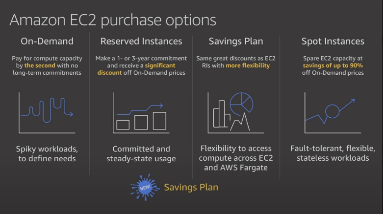
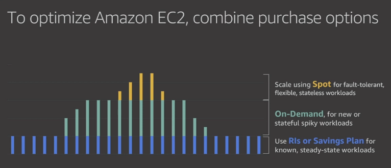

# CHAPTER 4 | EC2 The Backbone of AWS

## EC2

### [What's EC2](https://aws.amazon.com/ec2/)

Amazon Elastic Compute Cloud (Amazon EC2) is a web service that provides secure, resizable compute capacity in the cloud. It is designed to make web-scale cloud computing easier for developers.

### [EC2 Options](https://aws.amazon.com/ec2/pricing/)



* [On demand](https://aws.amazon.com/ec2/pricing/on-demand/): 
    - Users who wants the low cost & flexibility of Amazon Ec2 without any upfront payment or long-term commitment
    - Applications with short-term, spiky or unpredictable load that connot be interrupted
    - Applications being developed or tested for the first time on EC2
    - You pay for computing capacity by per hour or per second depending on which instances you run.
* [Reserved Instance (RI)](https://aws.amazon.com/ec2/pricing/reserved-instances/): 
    - Applications who have predictable loads or steady state
    - Provide a significant discount (up to 75%) compared to On-Demand pricing and provide a capacity reservation when used in a specific Availability Zone. You have to enter a contract.
        * Standard Reserved Instances - Payupfront and long term contract
        * Convertible Reserved Instances - Capability to change the attributes of RI as long as the exchange results in the cerations of RI's equal or greater value
        * Scheduled Reserved Instances - Available to launch within the time windows you reserved
* [Spot](https://aws.amazon.com/ec2/spot/): Amazon EC2 Spot instances allow you to request spare Amazon EC2 computing capacity for up to 90% off the On-Demand price.

  * If you terminate an instance, you will pay for the complete hour.
  * If Amazon terminates the instance, you won't pay for the complete hour.
  * The following are the possible reasons that Amazon EC2 might [interrupt your Spot Instances](https://docs.aws.amazon.com/AWSEC2/latest/UserGuide/spot-interruptions.html):
    * Price – The Spot price is greater than your maximum price.
    * Capacity – If there are not enough unused EC2 instances to meet the demand for Spot Instances, Amazon EC2 interrupts Spot Instances. The order in which the instances are interrupted is determined by Amazon EC2.
    * Constraints – If your request includes a constraint such as a launch group or an Availability Zone group, these Spot Instances are terminated as a group when the constraint can no longer be met.


* [Dedicated Hosts](https://aws.amazon.com/ec2/dedicated-hosts/): 
  - Is a physical server with EC2 instance capacity fully dedicated to your use.
  - Useful for regulatory requirements
  - Can be purchased on-demand
  - Great for licencing which does not support multi-tenancy or cloud deployments

### Launch an EC2 Instance - Lab

* Termination protection is turned off by default.
* The EBS root volume by default is deleted at termination.
* Default AMI's (provided by Amazon) can be encrypted.
* Additional volumes can be encrypted.

## Security groups - Lab

### [What's a security group](https://docs.aws.amazon.com/vpc/latest/userguide/VPC_SecurityGroups.html)

A security group acts as a virtual firewall for your instance to control inbound and outbound traffic.

* All Inbound traffic is Blocked by Default.
* All Outbound traffic is Blocked by Default.
* All security groups changes are applied immediately.
* Security groups are stateful. For example, if you allow the request to come in, automatically responses can go out even if you don't have anything on the outbound section of your security group.
* You can specify only allow rules, not deny rules.
* You can add multiple security groups to the same EC2 instance
* You can also attach same security groups to multiple EC2 instances

## EBS Volumes & Encrypt Root Device Volume - Lab

* Instances and Volumes MUST be in the same AZ
* Snapshots exists in S3.
* Snapshots are a point in time copies of Volumes.
* Snapshots are incremental (only differences are saved)
* Snapshot of root volumes require the instance to be stopped.
* _You can't delete a snapshot of an EBS volume that is used as the root device of a registered AMI._
* You can change EBS volumes size and type on the fly.
* To move an EC2 volume from one AZ/Region to another, take a snap or an image of it, then you can copy them to the new AZ/Region.
* Snapshots of encrypted volumes are encrypted automatically
* Volumes restored from an encrypted snapshot will be encrypted as well.
* You can share snapshots only if they are not encrypted, these snapshots can be made public.

### [AMI - Amazon Machine Image](https://docs.aws.amazon.com/AWSEC2/latest/UserGuide/AMIs.html)
An Amazon Machine Image (AMI) provides the information required to launch an instance. You must specify an AMI when you launch an instance. You can launch multiple instances from a single AMI when you need multiple instances with the same configuration. You can use different AMIs to launch instances when you need instances with different configurations.

An AMI includes the following:

 - One or more EBS snapshots, or, for instance-store-backed AMIs, a template for the root volume of the instance (for example, an operating system, an application server, and applications).

 - Launch permissions that control which AWS accounts can use the AMI to launch instances.

 - A block device mapping that specifies the volumes to attach to the instance when it's launched.

* 

### [AMI Types](https://aws.amazon.com/amazon-linux-ami/instance-type-matrix/)

An EBS snapshot is a backup of a single EBS volume. ... An AMI image is a backup of an entire EC2 instance. Associated with an AMI image are EBS snapshots. Those EBS snapshots are the backups of the individual EBS volumes attached to the EC2 instance at the time the AMI image was created

* [EBS](https://docs.aws.amazon.com/AWSEC2/latest/UserGuide/AmazonEBS.html): Amazon EBS provides durable, block-level storage volumes that you can attach to a running instance
  * EBS takes less time to provision.
  * EBS volumes can be kept once the instance is terminated.
* [Instance Store / Ephemeral storage](https://docs.aws.amazon.com/AWSEC2/latest/UserGuide/InstanceStorage.html): This storage is located on disks that are physically attached to the host computer

  * Instance Store Volumes can't be stopped, if the host fails, you lose data.
  * You can reboot the instance without losing data.
  * You can not detach Instance Store Volumes.
  * Instance store volumes cannot be kept once the instance is terminated.

 - For EBs Volums: The root device for an instance launched from the AMI is an Amazon EBS volume created from an Amazon EBS snapshot
 - For Instance Store Volumes: The root device for an instance launched from the AMI is an instnace store volume created from a template stored in Amzaom S3


## <u>ENI v/s ENA v/s EFA</u>

[ENI](https://docs.aws.amazon.com/AWSEC2/latest/UserGuide/using-eni.html) - Elastic Network Interface - A virtual network card
n elastic network interface is a logical networking component in a VPC that represents a virtual network card. It can include the following attributes:

 - A primary private IPv4 address from the IPv4 address range of your VPC
 - One or more secondary private IPv4 addresses from the IPv4 address range of your VPC
 - One Elastic IP address (IPv4) per private IPv4 address
 - One public IPv4 address
 - One or more IPv6 addresses
 - One or more security groups
 - A MAC address
 - A source/destination check flag
 - A description

Scenarios for network interfaces
Attaching multiple network interfaces to an instance is useful when you want to:
 - Create a management network.
 - Use network and security appliances in your VPC.
 - Create dual-homed instances with workloads/roles on distinct subnets.
 - Create a low-budget, high-availability solution.


[ENA](https://docs.aws.amazon.com/AWSEC2/latest/UserGuide/enhanced-networking.html) - Enhanced Networkling. Uses single root I/O virtualization (SR-IOV) to provide high-performance networking capabilities on supported instance types (All current generation instance types support enhanced networking, except for T2 instances.)

You can enable enhanced networking using one of the following mechanisms:

* <u>Elastic Network Adapter (ENA)</u>
The Elastic Network Adapter (ENA) supports network speeds of up to 100 Gbps for supported instance types.

  - The current generation instances use ENA for enhanced networking, except for C4, D2, and M4 instances smaller than m4.16xlarge.

* <u>Intel 82599 Virtual Function (VF) interface</u>
  - The Intel 82599 Virtual Function interface supports network speeds of up to 10 Gbps for supported instance types.

   - The following instance types use the Intel 82599 VF interface for enhanced networking: C3, C4, D2, I2, M4 (excluding m4.16xlarge), and R3.

[EFA](https://aws.amazon.com/hpc/efa/) - Elastic Fabric Adapter - A n/w device that you can attach to your Amazon EC2 instance to accelerate High Performance Computing (HPC) and maching learning applications. Elastic Fabric Adapter (EFA) is a network interface for Amazon EC2 instances that enables customers to run applications requiring high levels of inter-node communications at scale on AWS. Its custom-built operating system (OS) bypass hardware interface enhances the performance of inter-instance communications, which is critical to scaling these applications. With EFA, High Performance Computing (HPC) applications using the Message Passing Interface (MPI) and Machine Learning (ML) applications using NVIDIA Collective Communications Library (NCCL) can scale to thousands of CPUs or GPUs. As a result, you get the application performance of on-premises HPC clusters with the on-demand elasticity and flexibility of the AWS cloud.

Q: What are the differences between an EFA ENI and an ENA ENI?
---
An ENA ENI provides traditional IP networking features necessary to support VPC networking. An EFA ENI provides all the functionality of an ENA ENI, plus hardware support for applications to communicate directly with the EFA ENI without involving the instance kernel (OS-bypass communication) using an extended programming interface. Due to the advanced capabilities of the EFA ENI, EFA ENIs can only be attached at launch or to stopped instances.

## Spot Inatances and Spot Fleets
* Spot Instances save up tp 90% of the cost of on-demand inatances
* Useful for any type of computing where you don't need persistent storage
* You can block Spot from terminating by using Spot block
* A Spot Fleet is a collection of Spot instances and optionally on-demand instances

Spot Instances are userful for
* Big data & analytics
* Containerized workloads
* CI/CD & testing
* Web Services
* Image & media rendering
* High-performinance computing

Spot Fleet
* A Spot Fleet is a collection of Spot instances and optionally on-demand instances
* CapacityOptimized - Spot instance conme from a pool with optimal capacity for the number of instances launching
* LowestPrice - Spot instance come from the pool with the lowest price. This is the default strategy
* Diversified - Spot instances are distributed across all pools
* InstancePoolsToUseCount - Spot instances are distributed across the number of Sport instance pools you specify. The parameter is valid only when used in combination with lowestPrice

## EC2 Hibernate
When you hibernate an instance, Amazon EC2 signals the operating system to perform hibernation (suspend-to-disk). Hibernation saves the contents from the instance memory (RAM) to your Amazon Elastic Block Store (Amazon EBS) root volume. Amazon EC2 persists the instance's EBS root volume and any attached EBS data volumes. When you start your instance:
* The EBS root volume is restored to its previous state
* The RAM contents are reloaded
* The processes that were previously running on the instance are resumed
* Previously attached data volumes are reattached and the instance retains its instance ID
* You can hibernate an instance only if it's enabled for hibernation and it meets the hibernation prerequisites.
* In order to use Hibernation the root device volume should be encrypted
* Enable hibernation at launch - You cannot enable hibernation on an existing instance (running or stopped). For more information, see Enabling hibernation for an instance. Purchasing options - This feature is available for On-Demand Instances and Reserved Instances. It is not available for Spot Instances.
* Instances cannot be hibernated more than 60 days


## Elastic Load Balancers

### [What's an Elastic Load Balancer](https://aws.amazon.com/elasticloadbalancing/)

Elastic Load Balancing automatically distributes incoming application traffic across multiple targets, such as Amazon EC2 instances, and others.

### [Types of loadbalancers](https://aws.amazon.com/elasticloadbalancing/features/#Details_for_Elastic_Load_Balancing_Products)

* Application Load balancers: Best for load balancing HTTP & HTTPS traffic. They operate at layer 7.
* Network Load Balancer: Loadbalancing TCP traffic where extreme performance is needed. They operate at layer 4.
* Classic Load Balancer: Legacy ELB, mostly operate at layer 4, but can go up to 7.

### X-Forwarded-For

(XFF) The HTTP header field is a common method for identifying the originating IP address of a client connecting to a web server through an HTTP proxy or load balancer.

### Load Balancers - Lab

* You must set up health checks in order to let the load balancer to understand if the instances are up and running
* Load balancers won't expose any IP, instead they expose DNS names.

```bash
dig +short MyClassicELB-57286656.eu-west-2.elb.amazonaws.com
35.176.153.196
35.176.224.44
```

_At the time of writing, the lab instructs you to create one EC2 instance and configure the load balancer to simply point against it.
My suggestion is to create 2 instances instead and change the `index.html` in something like `instance_1` and `instance_2` so you can see what box the load balancer decides to send your requests. Doing so, allows you to also confirm that if an instance is down, the load balancer automatically forwards traffic to the remaining one still online._

### CloudWatch - Lab

* Standard monitoring is 5 min and detailed monitoring is 1 min (you will be charged for it)
* Dashboard used to visualize what's happening with your AWS environment.
* Alarms can be set to notify when a specific threshold is hit
* Events can be used to perform actions when state changes happen in your AWS resources.
* Logs can be aggregated in a single place to better troubleshoot. Remember that you need to install an agent on the EC2 instance.
* By default, Matrics on EC2 instances are: CPU related, Disk related, Network related and Status check related.

Remember that:

* CloudWatch: is for monitoring resources
* CloudTrail: is for auditing

### IAM Roles with EC2 - Lab

* Roles avoid you to store credentials inside EC2 instances in order to communicate with other AWS services
* Roles can be assigned after an EC2 instance has been provisioned
* Roles are universal, you can use them in any region.

### [EC2 Instance Metadata](https://docs.aws.amazon.com/AWSEC2/latest/UserGuide/ec2-instance-metadata.html)

Within your local instance run:

 ```http://169.254.169.254/latest/meta-data```

 This will give you the top level metadata items, something like this.

 ```text
 [ec2-user ~]$ curl http://169.254.169.254/latest/meta-data/
ami-id
ami-launch-index
ami-manifest-path
block-device-mapping/
events/
hostname
iam/
instance-action
instance-id
instance-type
local-hostname
local-ipv4
mac
metrics/
network/
placement/
profile
public-hostname
public-ipv4
public-keys/
reservation-id
security-groups
services/
```

If you want to access a specific item, simply add it at the end of your request:

```bash
[ec2-user ~]$ curl http://169.254.169.254/latest/meta-data/ami-id
ami-12345678
```

There is also one URL for user data

```bash
[ec2-user ~]$ curl http://169.254.169.254/latest/user-data/
```

### [Lanch configurations](https://docs.aws.amazon.com/autoscaling/ec2/userguide/LaunchConfiguration.html) and [Autoscaling Groups](https://docs.aws.amazon.com/autoscaling/ec2/userguide/AutoScalingGroup.html)

* A launch configuration is an instance configuration template that an Auto Scaling group uses to launch EC2 instances
* An Auto Scaling group contains a collection of Amazon EC2 instances that are treated as a logical grouping for the purposes of automatic scaling and management.

Autoscaling group will automatically spread evenly on the number of instances across the AZ you selected once you configured it. So 3 AZ with 3 as group size, means 1 box in each AZ

### [Placement Groups](https://docs.aws.amazon.com/AWSEC2/latest/UserGuide/placement-groups.html)

You can launch or start instances in a placement group, which determines how instances are placed on the underlying hardware. When you create a placement group, you specify one of the following strategies for the group:

* Cluster – clusters instances into a low-latency group in a single Availability Zone.

  
* Spread – spreads instances across underlying hardware and can spread in multiple Availability Zones.
  
* Partition – spreads instances across logical partitions, ensuring that instances in one partition do not share underlying hardware with instances in other partitions.

  

Some notes about placement groups:

* The name you specify for a placement group must be unique within your AWS account.
* Only specific types of instances can be launched in a placement group.
* You can't merge placement groups.
* You can't move an existing instance into a placement group.
* If the exam refers to placement groups, without mentioning which type, it's most probably talking about the Cluster ones since those are the old ones.

## AWS Storage Types - S3, EFS, & EBS
Lets talk about AWS Storage for a moment.

There have been a number of questions about the different storage types, which are Block storage which are Object storage and where EFS fits into the mix.  Below I hope to shed some light on the important differences so that you can make wise choices between them.

Storage 
Ultimately all storage has "block storage" at he lowest level (even SSDs which emulate disk blocks). The terminology used is not as important as understanding the distinctions in how the storage is interacted with. Rather than trying to memorize that this service has this title, or that service has that title, it is more useful to understand how they are used and the advantages and limitations that imposes​.

* S3, files on S3 can only be addressed as objects. You cannot interact with the contents of the object until you have extracted the object from S3  (GET). It cannot be edited in-place, you must extract it, change it, and them put it back to replace the original (PUT). What this comes down to is that here is no user "locking" functionality as might be offered by a 'file system' This is why it is called "Object storage".

* EFS is basically NFS (Network File System) which is an old and still viable Unix technology. As the title implies it is a "File System" and offers more capabilities than "Object Storage" .  The key to these is grades of 'File Locking' which makes it suitable for shared use. This is what makes it suitable for a share NETWORK file system. It is important to note that like Object Stores, you are still restricted to handling the file as a complete object. You can lock it so that you can write back to it, but you are restricted in the extent that you do partial content updates based on blocks. This gets a bit grey as there are ways to do partial updates, but they are limited.

* EBS is closer to locally attached disk whether that be IDE, SAS, SCSI (or it's close cousin iSCSI/Fibre Channel, which is in reality just SCSI over a pipe). With Locally attached disk you have better responsiveness and addressing. This allows you to use File Systems that can address the disk at a block level. This includes part reads, part writes, read ahead, delayed writes, file system maintenance where you swap block under the file, block level cloning, thin provisioning, deduplication etc. As noted above, Block Storage sits underneath both NFS and Object stores, but as a consumer you are abstracted away and cannot make direct use of them.

## [Lambda](https://aws.amazon.com/lambda/)

AWS Lambda lets you run code without provisioning or managing servers. You pay only for the compute time you consume - there is no charge when your code is not running.
Lambda basically is based on triggers.

You can use lambda in two ways:

* Event-driven based: Lambda runs your code based on events, such, new file on S3 or a new alarm on cloudwatch
* Compute-service based: Lambda runs your code based on HTTP requests using an API Gateway or API calls made using AWS SDKs.

AWS lambda, supports: C#, Node.js, Python, and Java

Lambda is charged as follow:

* First 1M requests per month are free. $0.20 PER 1M requests thereafter
* Duration: You are charged for the amount of memory you allocate on your functions. First 400,000 GB-seconds per month, up to 3.2M seconds of computing time, are free.
* Your functions can't go over 5 minutes in run-time.

_Make sure you have a look at what [CORS](https://docs.aws.amazon.com/AmazonS3/latest/dev/cors.html) is._


## [HPC on AWS - Component Services](https://aws.amazon.com/hpc/)
* Data Management & Transfer
  - [AWS DataSync](https://aws.amazon.com/datasync/)
  - [AWS Snowball](https://aws.amazon.com/snowball/)
  - [AWS Snowmobile](https://aws.amazon.com/snowmobile/)
  - [AWS DirectConnect](https://aws.amazon.com/directconnect/)
* Compute & Networking
  - [Amazon EC2 instances(CPU, CPU, FPGA)](https://aws.amazon.com/ec2/)
  - [Amazon EC2 spot](https://aws.amazon.com/ec2/spot/)
  - [AWS Auto scaling](https://aws.amazon.com/autoscaling/)
  - [Placement groups](https://docs.aws.amazon.com/AWSEC2/latest/UserGuide/placement-groups.html)
  - [Enhanced Networking](https://docs.aws.amazon.com/AWSEC2/latest/UserGuide/enhanced-networking.html)
  - [Elastic Fabric Adapter](https://aws.amazon.com/hpc/efa/)
  - [AWS VPC](https://aws.amazon.com/vpc/)
* Storage
  - [Amazon EBS with provisioned IOPS](https://aws.amazon.com/ebs/)
  - [Amazon Fsx for Lustre](https://aws.amazon.com/fsx/lustre/)
  - [Amazon EFS](https://aws.amazon.com/efs/)
  - [Amazon S3](https://aws.amazon.com/s3/)
* Automation & Orchestration
  - [AWS Batch](https://aws.amazon.com/batch/)
  - [AWS ParallelCliuster](https://aws.amazon.com/hpc/parallelcluster/)
  - [NICE EnginFrame](https://www.nice-software.com/download/enginframe-on-aws)
* Visualization
  - [NICE DCV](https://aws.amazon.com/hpc/dcv/)
  - [Amazon AppStream 2.0](https://aws.amazon.com/appstream2/)
* Operation & Management
  - [Amazon CloudWatch](https://aws.amazon.com/cloudwatch/)
  - [AWS Budgets](https://aws.amazon.com/aws-cost-management/aws-budgets/)
* Security & Compliance
  - [AWS Identity & Access Management](https://aws.amazon.com/iam/)

## [AWS WAF](https://aws.amazon.com/waf/)
  AWS WAF is a web application firewall that helps protect your web applications or APIs against common web exploits that may affect availability, compromise security, or consume excessive resources. AWS WAF gives you control over how traffic reaches your applications by enabling you to create security rules that block common attack patterns, such as SQL injection or cross-site scripting, and rules that filter out specific traffic patterns you define. You can get started quickly using Managed Rules for AWS WAF, a pre-configured set of rules managed by AWS or AWS Marketplace Sellers. The Managed Rules for WAF address issues like the OWASP Top 10 security risks. These rules are regularly updated as new issues emerge. AWS WAF includes a full-featured API that you can use to automate the creation, deployment, and maintenance of security rules.

With AWS WAF, you pay only for what you use. The pricing is based on how many rules you deploy and how many web requests your application receives. There are no upfront commitments.

You can deploy AWS WAF on Amazon CloudFront as part of your CDN solution, the Application Load Balancer that fronts your web servers or origin servers running on EC2, or Amazon API Gateway for your APIs.


# [AWS Cloud Data Migration Services](https://aws.amazon.com/cloud-data-migration/)

## Hybrid cloud storage
### [AWS Storage Gateway](https://aws.amazon.com/storagegateway/)

[AWS Storage Gateway](https://aws.amazon.com/storagegateway/) simplifies on-premises adoption of AWS Storage. Storage Gateway lets you seamlessly connect and extend your on-premises applications to AWS Storage. Customers use Storage Gateway to seamlessly replace tape libraries with cloud storage, provide cloud storage-backed file shares, or create a low-latency cache to access data in AWS for on-premises applications. The service provides three different types of gateways – File Gateway, Tape Gateway, and Volume Gateway.

**File Gateway** - presents SMB or NFS file shares for on-premises applications to store files as S3 objects and access them with traditional file interfaces.
**Tape Gateway** - virtual tape library (VTL) configuration seamlessly integrates with your existing backup software for cost effective tape replacement in Amazon S3 and long term archival in S3 Glacier and S3 Glacier Deep Archive.

**Volume Gateway** - stores or caches block volumes locally, with point-in-time backups as EBS snapshots. These snapshots may be recovered in the cloud.


### [AWS Direct Connect](https://aws.amazon.com/directconnect/)

Customers select a Direct Connect dedicated physical connection to accelerate network transfers between their datacenters and AWS datacenters.

[AWS Direct Connect](https://aws.amazon.com/directconnect/) lets you establish a dedicated network connection between your network and one of the AWS Direct Connect locations. Using industry standard 802.1q VLANs, this dedicated connection can be partitioned into multiple virtual interfaces. This enables you to use the same connection to access public resources such as objects stored in Amazon S3 using public IP address space, and private resources such as Amazon EC2 instances running within an Amazon Virtual Private Cloud (VPC) using private IP space, while maintaining network separation between the public and private environments. Virtual interfaces can be reconfigured at any time to meet your changing needs.

Explore our AWS Direct Connect Partner Bundles that help extend on-premises technologies to the cloud. 

---
## Online data transfer
### [AWS DataSync](https://aws.amazon.com/datasync/)

[AWS DataSync](https://aws.amazon.com/datasync/) is a data transfer service that makes it easy for you to automate moving data between on-premises storage and Amazon S3, Amazon Elastic File System (Amazon EFS), or Amazon FSx for Windows File Server. DataSync automatically handles many of the tasks related to data transfers that can slow down migrations or burden your IT operations, including running your own instances, handling encryption, managing scripts, network optimization, and data integrity validation. You can use DataSync to transfer data at speeds up to 10 times faster than open-source tools. You can use DataSync to copy data over AWS Direct Connect or internet links to AWS for one-time data migrations, recurring data processing workflows, and automated replication for data protection and recovery.

### [AWS Transfer Family](https://aws.amazon.com/aws-transfer-family/)

The [AWS Transfer Family](https://aws.amazon.com/aws-transfer-family/) provides fully managed support for file transfers directly into and out of Amazon S3. With support for Secure File Transfer Protocol (SFTP), File Transfer Protocol over SSL (FTPS), and File Transfer Protocol (FTP), the AWS Transfer Family helps you seamlessly migrate your file transfer workflows to AWS by integrating with existing authentication systems, and providing DNS routing with Amazon Route 53 so nothing changes for your customers and partners, or their applications. With your data in Amazon S3, you can use it with AWS services for processing, analytics, machine learning, and archiving. Getting started with the AWS Transfer Family is easy; there is no infrastructure to buy and set up.


### [Amazon S3 Transfer Acceleration](https://aws.amazon.com/s3/transfer-acceleration/)

[Amazon S3 Transfer Acceleration](https://aws.amazon.com/s3/transfer-acceleration/) makes public internet transfers to Amazon S3 faster. You can maximize your available bandwidth regardless of distance or varying internet weather, and there are no special clients or proprietary network protocols. Simply change the endpoint you use with your S3 bucket and acceleration is automatically applied.

This is ideal for recurring jobs that travel across the globe, such as media uploads, backups, and local data processing tasks that are regularly sent to a central location.


### [AWS Snowcone](https://aws.amazon.com/snowcone/)

[AWS Snowcone](https://aws.amazon.com/snowcone/) is the smallest member of the AWS Snow Family of edge computing and data transfer devices. Snowcone is portable, rugged, and secure. You can use Snowcone to collect, process, and move data to AWS online with AWS DataSync. Running applications in disconnected environments and connected edge locations can be challenging because these locations often lack the space, power, and cooling needed for data center IT equipment. AWS Snowcone stores data securely in edge locations, and can run edge computing workloads that use AWS IoT Greengrass or Amazon EC2 instances. Snowcone devices are small and weigh 4.5 lbs. (2.1 kg), so you can carry one in a backpack or fit it in tight spaces for IoT, vehicular, or even drone use cases.


### [Amazon Kinesis Data Firehose](https://aws.amazon.com/kinesis/firehose/)

[Amazon Kinesis Data Firehose](https://aws.amazon.com/kinesis/firehose/) Data Firehose is the easiest way to load streaming data into AWS. It can capture and automatically load streaming data into Amazon S3 and Amazon Redshift, enabling near real-time analytics with existing business intelligence tools and dashboards you’re already using today. It is a fully managed service that automatically scales to match the throughput of your data and requires no ongoing administration. It can also batch, compress, and encrypt the data before loading it, minimizing the amount of storage used at the destination and increasing security. You can easily create a Firehose delivery stream from the AWS Management Console, configure it with a few clicks, and start sending data to the stream from hundreds of thousands of data sources to be loaded continuously to AWS – all in just a few minutes.


### [APN Partner Products](https://aws.amazon.com/backup-recovery/partner-solutions/)

AWS has partnered with a number of industry vendors on physical gateway appliances that bridge the gap between traditional backup and cloud. Link existing on-premises data to Amazon's cloud to make the move without impacting performance and preserving existing backup catalogs.

Seamlessly integrates into existing infrastructure
May offer deduplication, compression, encryption or WAN acceleration
Cache recent backups locally, vault everything to the AWS Cloud

---
## Offline data transfer
### [AWS Snowcone](https://aws.amazon.com/snowcone/)

[AWS Snowcone](https://aws.amazon.com/snowcone/) is the smallest member of the AWS Snow Family of edge computing and data transfer devices. Snowcone is portable, rugged, and secure. You can use Snowcone to collect, process, and move data to AWS offline by shipping the device. Running applications in disconnected environments and connected edge locations can be challenging because these locations often lack the space, power, and cooling needed for data center IT equipment. AWS Snowcone stores data securely in edge locations, and can run edge computing workloads that use AWS IoT Greengrass or Amazon EC2 instances. Snowcone devices are small and weigh 4.5 lbs. (2.1 kg), so you can carry one in a backpack or fit it in tight spaces for IoT, vehicular, or even drone use cases.


### [AWS Snowball](https://aws.amazon.com/snowball/)

[AWS Snowball](https://aws.amazon.com/snowball/) is a petabyte-scale data transport and edge computing device that comes with on-board storage and compute capabilities and is availble in two options. Snowball Edge Storage Optimized devices provide both block storage and Amazon S3-compatible object storage, and 40 vCPUs. They are well suited for local storage and large scale-data transfer. Snowball Edge Compute Optimized devices provide 52 vCPUs, block and object storage, and an optional GPU for use cases like advanced machine learning and full motion video analysis in disconnected environments. You can use these devices for data collection, machine learning and processing, and storage in environments with intermittent connectivity (like manufacturing, industrial, and transportation) or in extremely remote locations (like military or maritime operations) before shipping them back to AWS. These devices may also be rack mounted and clustered together to build larger temporary installations.


### [AWS Snowmobile](https://aws.amazon.com/snowmobile/)

[AWS Snowmobile](https://aws.amazon.com/snowmobile/) is an exabyte-scale data transport solution that uses a secure semi 40-foot shipping container to transfer large amounts of data into and out of AWS. Using Snowmobile addresses common challenges with large-scale data transfers including high network costs, long transfer times, and security concerns. Transferring data with Snowmobile is done through a custom engagement, is fast, secure, and can be as little as one-fifth the cost of high-speed internet.

---

## Unmanaged cloud data migration tools
AWS also offers easy script or CLI tools to move data from your site into AWS cloud storage.

### [rsync](https://rsync.samba.org/)

Customers use [rsync](https://rsync.samba.org/), an open source tool, along with 3rd party file system tools to copy data directly into S3 buckets.

### [S3 command line interface](https://docs.aws.amazon.com/cli/latest/reference/s3/sync.html)

Customers use the [S3 command line interface](https://docs.aws.amazon.com/cli/latest/reference/s3/sync.html) to write commands to move data directly into S3 buckets.


### [S3 Glacier command line interface](http://docs.aws.amazon.com/cli/latest/userguide/cli-using-glacier.html)

Customers use the [S3 Glacier command line interface](http://docs.aws.amazon.com/cli/latest/userguide/cli-using-glacier.html) to move data into S3 Glacier vaults.

---

Q: How are my Amazon EBS encryption keys managed?
---
Amazon EBS encryption handles key management for you. Each newly created volume gets a unique 256-bit AES key; Volumes created from the encrypted snapshots share the key. These keys are protected by our own key management infrastructure, which implements strong logical and physical security controls to prevent unauthorized access. Your data and associated keys are encrypted using the industry-standard AES-256 algorithm.

Q: Will I be billed for the IOPS provisioned on a Provisioned IOPS volume when it is disconnected from an instance?
---

Yes, you will be billed for the IOPS provisioned when it is disconnected from an instance. When a volume is detached, we recommend you consider creating a snapshot and deleting the volume to reduce costs. For more information, see the "Underutilized Amazon EBS Volumes" cost optimization check in Trusted Advisor. This item checks your Amazon Elastic Block Store (Amazon EBS) volume configurations and warns when volumes appear to be underused.

Q: What is AWS multi-attach
---
EBS Multi-Attach allows the attachment of a single io1 Provisioned IOPS volume to up to 16 Nitro-based instances in the same Availability Zone. EBS Multi-Attach volumes can be used as a block-level subcomponent of an overall shared storage solution.

Q. How do I load data into a file system?
---
You can load data into an Amazon EFS file system from your Amazon EC2 instances or from your on-premises datacenter servers.

Amazon EFS file systems can be mounted on an Amazon EC2 instance, so any data that is accessible to an Amazon EC2 instance can also be read and written to Amazon EFS. To load data that is not currently stored on the Amazon cloud, you can use the same methods you use to transfer files to Amazon EC2 today, such as Secure Copy (SCP).

Amazon EFS file systems can also be mounted on an on-premises server, so any data that is accessible to an on-premises server can be read and written to Amazon EFS using standard Linux tools.

Q. How do I access my file system from outside my VPC?
---
Amazon EC2 instances within your VPC can access your file system directly, and Amazon EC2 Classic instances outside your VPC can mount a file system via ClassicLink. On-premises servers can mount your file systems via an AWS Direct Connect connection to your VPC.

Q. How many Amazon EC2 instances can connect to a file system?
---
Amazon EFS supports one to thousands of Amazon EC2 instances connecting to a file system concurrently.


Q: Which instance types offer NVMe instance storage?
---
Today, I3en, I3, C6gd, C5d, C5ad, M6gd, M5d, M5dn, M5ad, R6gd, R5d, R5dn, R5ad, z1d, P3dn, G4dn, and F1, X1, X1e instances offer NVMe instance storage.

Q: What encryption algorithm is used to encrypt Amazon EC2 NVMe instance storage?
---
Amazon EC2 NVMe instance storage is encrypted using an XTS-AES-256 block cipher.

Q: Can I disable NVMe instance storage encryption?
---
No, NVMe instance storage encryption is always on, and cannot be disabled.

Q: Does Amazon EC2 NVMe instance storage support AWS Key Management Service (KMS)?
---
No, disk encryption on NVMe instance storage does not support integration with AWS KMS system. Customers cannot bring in their own keys to use with NVMe instance storage. 

Q: Can I enable hibernation on an existing instance?
---
No, you cannot enable hibernation on an existing instance (running or stopped). This needs to be enabled during instance launch.

Q: How long can I keep my instance hibernated?
---
Currently keeping an instance hibernated for more than 60 days is not supported. You need to resume the instance and go through Stop and Start (without hibernation) if you wish to keep the instance around for a longer duration.


Q: What if my EBS root volume is not large enough to store memory state (RAM) for hibernate?
---
To enable hibernation, space is allocated on the root volume to store the instance memory (RAM). Make sure that the root volume is large enough to store the RAM contents and accommodate your expected usage, e.g. OS, applications. If the EBS root volume does not enough space, hibernation will fail and the instance will get shutdown instead.


Q. What is VM Import/Export?
---
VM Import/Export enables customers to import Virtual Machine (VM) images in order to create Amazon EC2 instances. Customers can also export previously imported EC2 instances to create VMs. Customers can use VM Import/Export to leverage their previous investments in building VMs by migrating their VMs to Amazon EC2.

Capacity Reservations
---
On-Demand Capacity Reservation is an EC2 offering that lets you create and manage reserved capacity on Amazon EC2. You can create a Capacity Reservation by choosing an Availability Zone and quantity (number of instances) along with other instance specifications such as instance type and tenancy. Once created, the EC2 capacity is held for you regardless of whether you run the instances or not.

Reserved Instance
---
A Reserved Instance (RI) is an EC2 offering that provides you with a significant discount on EC2 usage when you commit to a one-year or three-year term.
* Standard Reserved Instance - Standard RIs offer a significant discount on EC2 instance usage when you commit to a particular instance family.
* Convertible Reserved Instance - Convertible RIs offer you the option to change your instance configuration during the term, and still receive a discount on your EC2 usage.

# [Amazon EC2 Instance Types](https://aws.amazon.com/ec2/instance-types/)
* General Purpose - General purpose instances provide a balance of compute, memory and networking resources, and can be used for a variety of diverse workloads. These instances are ideal for applications that use these resources in equal proportions such as web servers and code repositories. 
A1 / T4g / T3 / T3a / T2 / M6g / M5 / M5a / M5n / M4

* Compute Optimized - Compute Optimized instances are ideal for compute bound applications that benefit from high performance processors. Instances belonging to this family are well suited for batch processing workloads, media transcoding, high performance web servers, high performance computing (HPC), scientific modeling, dedicated gaming servers and ad server engines, machine learning inference and other compute intensive applications.
C6g / C5 / C5a / C5n / C4

* Storage Optimized - Storage optimized instances are designed for workloads that require high, sequential read and write access to very large data sets on local storage. They are optimized to deliver tens of thousands of low-latency, random I/O operations per second (IOPS) to applications.<br/>
I3 /  I3en / D2 / H1

* Accelerated Computing - Accelerated computing instances use hardware accelerators, or co-processors, to perform functions, such as floating point number calculations, graphics processing, or data pattern matching, more efficiently than is possible in software running on CPUs.
P4 / P3 / P2 / Inf1 / G4 / G3 / F1

* Memory Optimized - Memory optimized instances are designed to deliver fast performance for workloads that process large data sets in memory.
R6g / R5 / R5a / R5n / R4 / X1e / X1 / High Memory / z1d

Q: Can EC2 Auto Scaling groups span multiple AWS regions?
---
EC2 Auto Scaling groups are regional constructs. They can span Availability Zones, but not AWS regions.

Q: How can I implement changes across multiple instances in an EC2 Auto Scaling group?
---
You can use AWS CodeDeploy or CloudFormation to orchestrate code changes to multiple instances in your EC2 Auto Scaling group.

Q: If I have data installed in an EC2 Auto Scaling group, and a new instance is dynamically created later, is the data copied over to the new instances?
---
Data is not automatically copied from existing instances to new instances. You can use lifecycle hooks to copy the data, or an Amazon RDS database including replicas.

Q: Which health check type should I select?
---
If you are using Elastic Load Balancing (ELB) with your group, you should select an ELB health check. If you’re not using ELB with your group, you should select the EC2 health check.

Q: How do I control which instances Amazon EC2 Auto Scaling terminates when scaling in, and how do I protect data on an instance?
---
With each Amazon EC2 Auto Scaling group, you control when Amazon EC2 Auto Scaling adds instances (referred to as scaling out) or remove instances (referred to as scaling in) from your group. You can scale the size of your group manually by attaching and detaching instances, or you can automate the process through the use of a scaling policy. When you have Amazon EC2 Auto Scaling automatically scale in, you must decide which instances Amazon EC2 Auto Scaling should terminate first. You can configure this through the use of a termination policy. You can also use instance protection to prevent Amazon EC2 Auto Scaling from selecting specific instances for termination when scaling in. If you have data on an instance, and you need that data to be persistent even if your instance is scaled in, then you can use a service like S3, RDS, or DynamoDB, to make sure that it is stored off the instance.

Q: If Elastic Load Balancing (ELB) determines that an instance is unhealthy, and moved offline, will the previous requests sent to the failed instance be queued and rerouted to other instances within the group?
---
When ELB notices that the instance is unhealthy, it will stop routing requests to it. However, prior to discovering that the instance is unhealthy, some requests to that instance will fail.


# Elastic Container Registry
Q: What is Amazon Elastic Container Registry (ECR)?
---
Amazon Elastic Container Registry (ECR) is a fully-managed container registry that makes it easy for developers to share and deploy container images and artifacts. Amazon ECR is integrated with Amazon Elastic Container Service (ECS),  Amazon Elastic Kubernetes Service (EKS), and AWS Lambda, simplifying your development to production workflow. Amazon ECR eliminates the need to operate your own container repositories or worry about scaling the underlying infrastructure. Amazon ECR hosts your images in a highly available and scalable architecture, allowing you to reliably deploy containers for your applications. Integration with AWS Identity and Access Management (IAM) provides resource-level control of each repository that lets you share images across your organization or with anyone in the world.

# Amazon Elastic Container Service
Amazon Elastic Container Service (Amazon ECS) is a fully managed container orchestration service. ECS is a great choice to run containers for several reasons. First, you can choose to run your ECS clusters using AWS Fargate, which is serverless compute for containers. Fargate removes the need to provision and manage servers, lets you specify and pay for resources per application, and improves security through application isolation by design.


Q: How is Amazon ECS different from AWS Elastic Beanstalk?
---
AWS Elastic Beanstalk is an application management platform that helps customers easily deploy and scale web applications and services. It keeps the provisioning of building blocks (e.g., EC2, RDS, Elastic Load Balancing, Auto Scaling, CloudWatch), deployment of applications, and health monitoring abstracted from the user so they can just focus on writing code. You simply specify which container images are to be deployed, the CPU and memory requirements, the port mappings, and the container links.

Elastic Beanstalk will automatically handle all the details such as provisioning an Amazon ECS cluster, balancing load, auto-scaling, monitoring, and placing your containers across your cluster. Elastic Beanstalk is ideal if you want to leverage the benefits of containers but just want the simplicity of deploying applications from development to production by uploading a container image. You can work with Amazon ECS directly if you want more fine-grained control for custom application architectures.

Q: Does Amazon ECS support any other container types?
---
No. Docker is the only container platform supported by Amazon ECS at this time.There is EKS (Elastic Kubernetes Service)