# API Gateway
* Amazon API Gateway is a fully managed service that makes it easy for developers to publish, maintain, monitor, and secure APIs at any scale
* Amazon API Gateway handles all of the tasks involved in accepting and processing up to hundreds of thousands of concurrent API calls, including traffic management, authorization and access control, monitoring, and API version management
* Amazon API Gateway has no minimum fees or startup cost
* For HTTP APIs and REST APIs, you pay only for the API calls you receive and the amount of data transferred out
* For WebSocket APIs, you pay only for messages sent and received and for the time a user/device is connected to the WebSocket API
* Logs, alarms, error rates and other metrics are stored in Amazon CloudWatch and are available near real time.

## Why use Amazon API Gateway?
* Metering
* Security
* Resiliency
* Operations Monitoring
* Lifecyclle Management
* Designed for Developers
* Real time Two-way communication

## ..Supports...
* HTTP API: HTTP APIs are optimized for building APIs that proxy to AWS Lambda functions or HTTP backends, making them ideal for serverless workloads. They do not currently offer API management functionality

* REST API: REST APIs offer API proxy functionality and API management features in a single solution. REST APIs offer API management features such as usage plans, API keys, publishing, and monetizing APIs

* WebSocket API: WebSocket APIs maintain a persistent connection between connected clients to enable real-time message communication. With WebSocket APIs in API Gateway, you can define backend integrations with AWS Lambda functions, Amazon Kinesis, or any HTTP endpoint to be invoked when messages are received from the connected clients

## Security
* Amazon API Gateway can generate API keys for distribution to third-party developers
* API Gateway supports throttling settings for each method or route in your APIs to prevent API abuse or threats
* Amazon API Gateway can generate a client-side SSL certificate and make the public key of that certificate available to you which will help in verification that API Gateway is calling tyour backend
* API Gateway Integrates with CloudTrail and create, modify, delete, or deploy REST API calls are looged
* API Gateway, you can proxy requests to backend HTTP/HTTPS resources running in your Amazon VPC by setting up Private Integrations using VPC Links
* Lambda authorizers are AWS Lambda functions. With custom request authorizers, you will be able to authorize access to APIs using a bearer token auth strategy such as OAuth

## Trottling
* Amazon API Gateway provides throttling at multiple levels including global and by service call. Throttling limits can be set for standard rates and bursts. For example, API owners can set a rate limit of 1,000 requests per second for a specific method in their REST APIs, and also configure Amazon API Gateway to handle a burst of 2,000 requests per second for a few seconds. Amazon API Gateway tracks the number of requests per second. Any requests over the limit will receive a 429 HTTP response
* Throttling ensures that API traffic is controlled to help your backend services maintain performance and availability
* Throttling rate limits can be set at the method level
* How are throttling rules applied - Amazon API Gateway provides two basic types of throttling-related settings:
    * Server-side throttling limits are applied across all clients. These limit settings exist to prevent your API—and your account—from being overwhelmed by too many requests.
    * Per-client throttling limits are applied to clients that use API keys associated with your usage policy as client identifier.
    
    API Gateway throttling-related settings are applied in the following order:
    * Per-client per-method throttling limits that you set for an API stage in a usage plan
    * Per-client throttling limits that you set in a usage plan
    * Default per-method limits and individual per-method limits that you set in API stage settings
    * Account-level throttling per Region

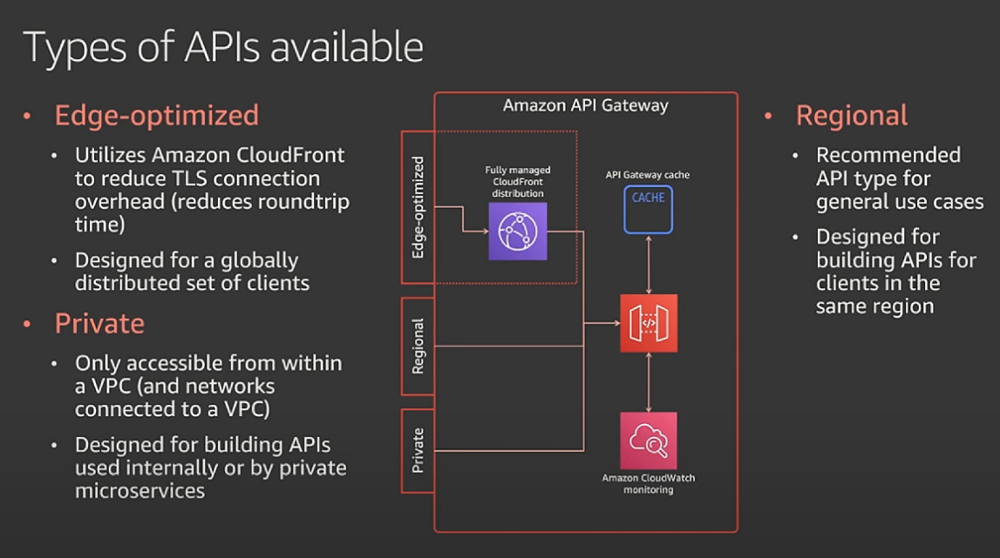
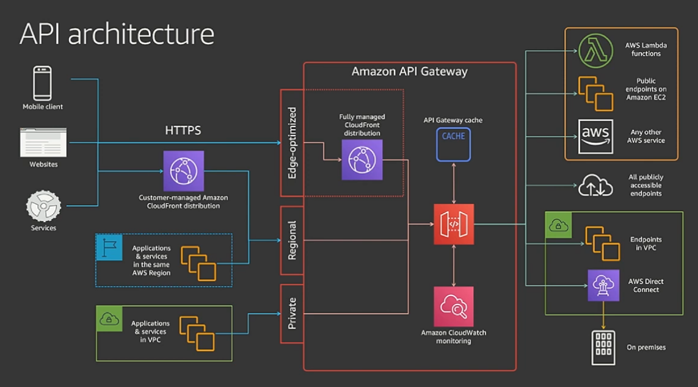
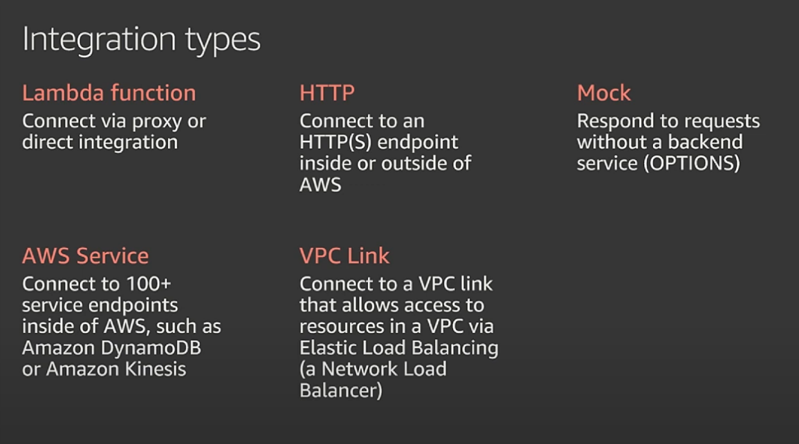
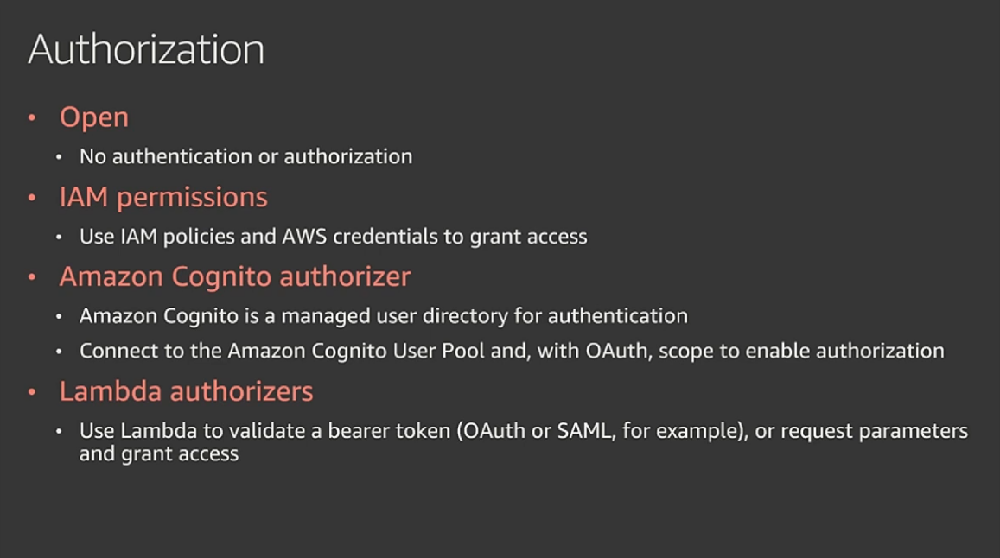
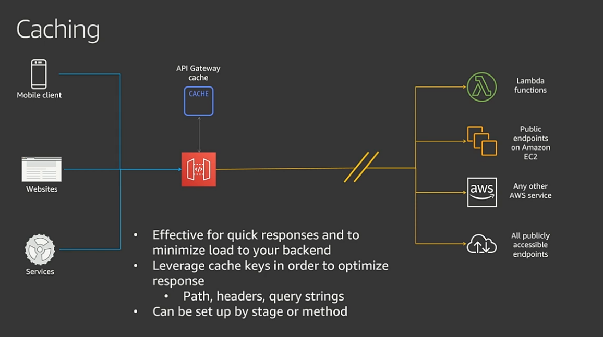
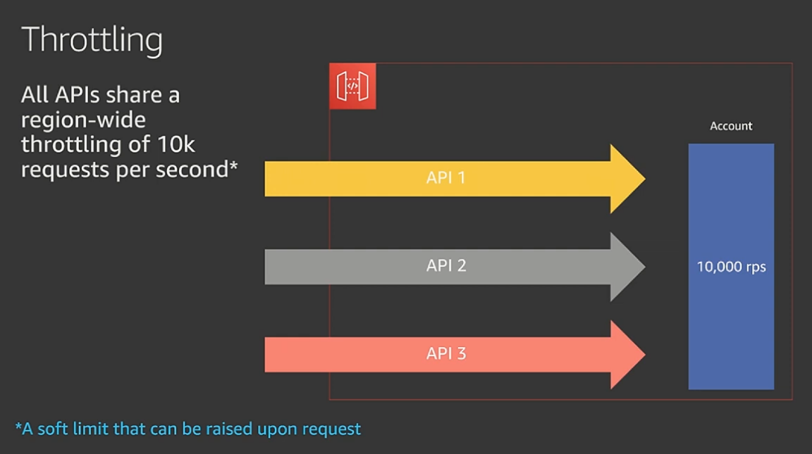
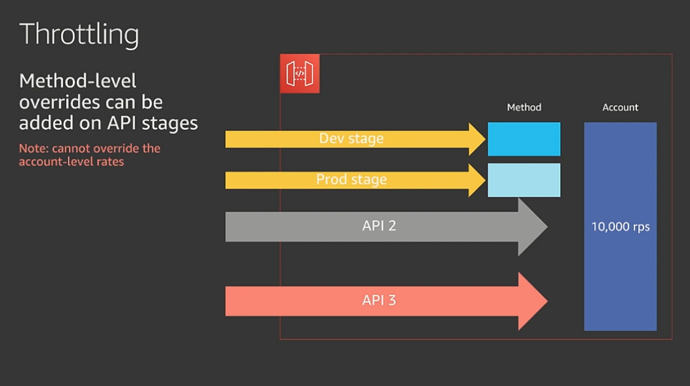
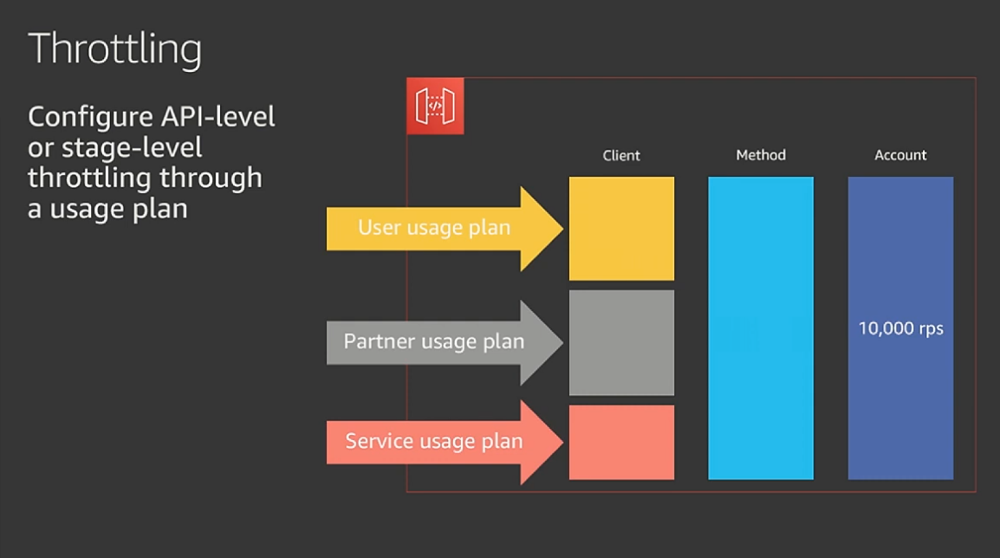
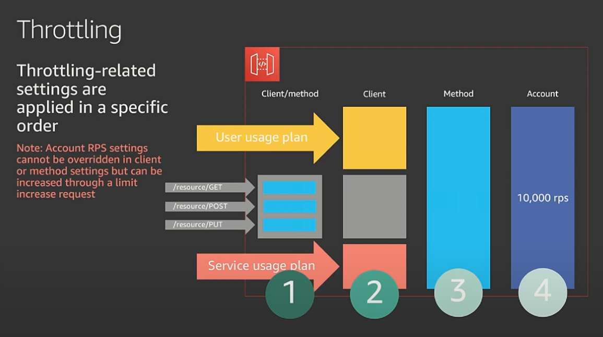
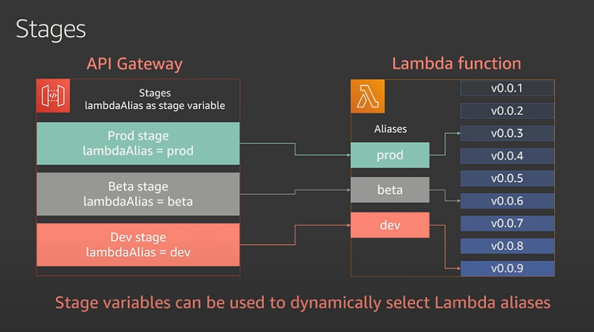
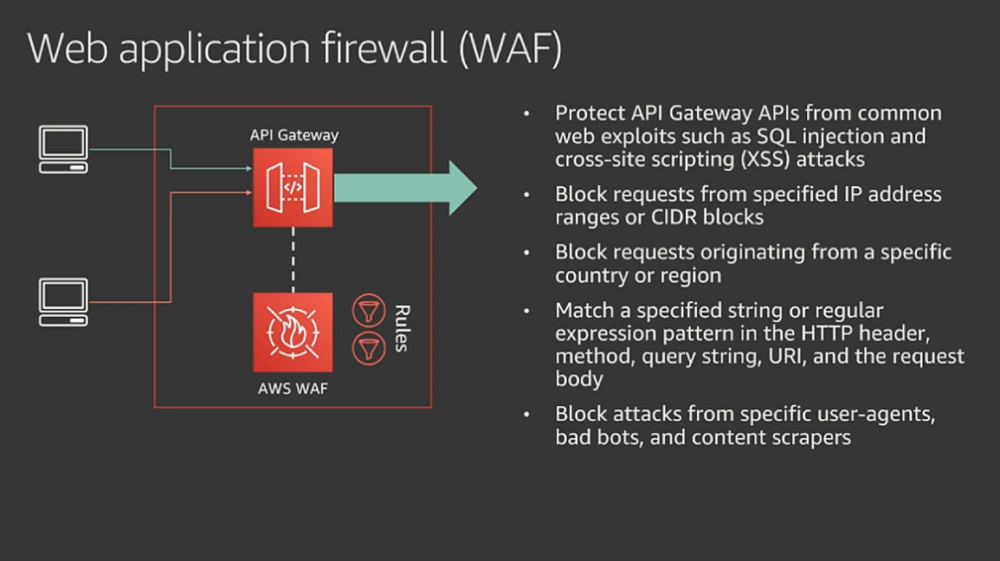
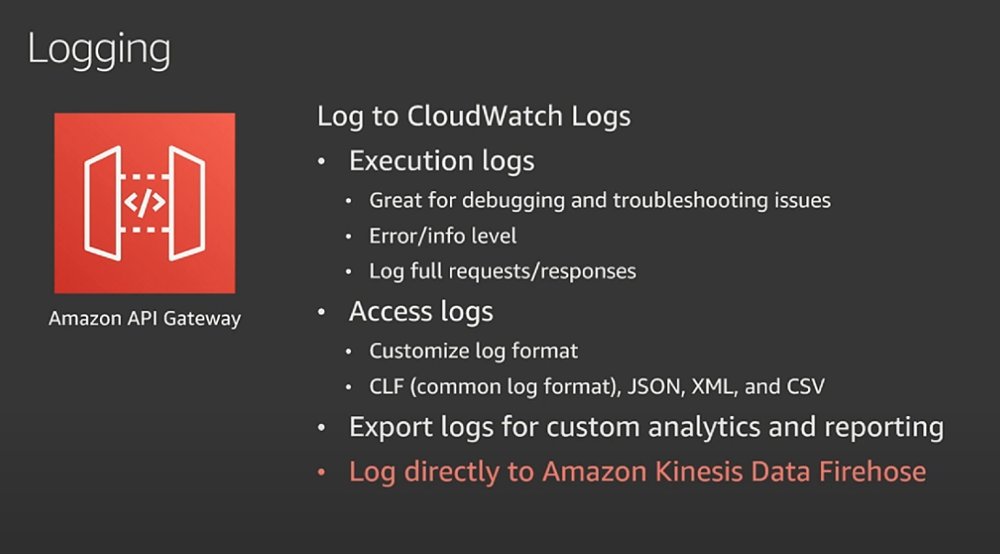
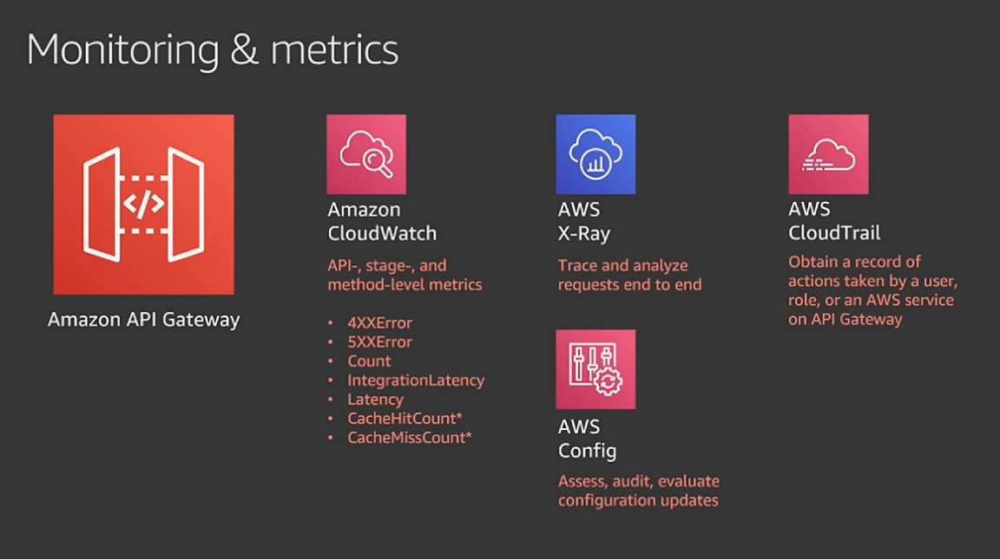