# CHAPTER 7 | VPC

## VPC

### [Wat's a VPC](https://aws.amazon.com/vpc/)

Think of a VPC as a virtual data centre in the cloud.

Amazon Virtual Private Cloud (Amazon VPC) lets you provision a logically isolated section of the AWS Cloud where you can launch AWS resources in a virtual network that you define. You have complete control over your virtual networking environment, including selection of your own IP address range, creation of subnets, and configuration of route tables and network gateways.

### What are the components of Amazon VPC

* A Virtual Private Cloud: A logically isolated virtual network in the AWS cloud. You define a VPC’s IP address space from ranges you select.
* Subnet: A segment of a VPC’s IP address range where you can place groups of isolated resources.
* Internet Gateway: The Amazon VPC side of a connection to the public Internet.
* NAT Gateway: A highly available, managed Network Address Translation (NAT) service for your resources in a private subnet to access the Internet.
* Virtual private gateway: The Amazon VPC side of a VPN connection.
* Peering Connection: A peering connection enables you to route traffic via private IP addresses between two peered VPCs.
* VPC Endpoints: Enables private connectivity to services hosted in AWS, from within your VPC without using an Internet Gateway, VPN, Network Address Translation (NAT) devices, or firewall proxies. There are two types of VPC endpoint - gateway type & interface type endpoint. Gateway endpoint is only for Amazon S3 and DynamoDB.

* Egress-only Internet Gateway: A stateful gateway to provide egress only access for **IPv6** traffic from the VPC to the Internet.

* You can have multiple VPC in a region (default up to 5).
* You can have 1 internet gateway per VPC.
* 1 Subnet = 1 AZ
* Security groups are Stateful, instead, Network ACLs are stateless.

### Default VPC

* Amazon provides a default VPC to immediately deploy instances
* Default VPC has 3 subnet in different availability Zone
* A default Security Group
* A default ACL
* A defaukt route table
* A default Internet Gateway (IGW)
* All Subnets in default VPC have a route out to the internet

## VPC Sizing
* VPC needs a set of IP addresses in the form of a Classless Inter-Domain Routing (CIDR) block for e.g, 10.0.0.0/16, which allows 2^16 (65536) IP address to be available 
* Allowed CIDR block size is between
    * /28 netmask (minimum with 2^4 – 16 available IP address) and
    * /16 netmask (maximum with 2^16 – 65536 IP address)
* CIDR block from private (non-publicly routable) IP address can be assigned
    * 10.0.0.0 – 10.255.255.255 (10/8 prefix)
    * 172.16.0.0 – 172.31.255.255 (172.16/12 prefix)
    * 192.168.0.0 – 192.168.255.255 (192.168/16 prefix)
* It’s possible to specify a range of publicly routable IP addresses; however, direct access to the Internet is not currently supported from publicly routable CIDR blocks in a VPC
* VPC size can be increased after creating the VPC
* Each VPC is separate from any other VPC created with the same CIDR block even if it resides within the same AWS account
* VPC allows VPC Peering connections with other VPC within the same or different AWS accounts
* Connection between your VPC and corporate or home network can be established, however the CIDR blocks should not be overlapping for e.g. VPC with CIDR 10.0.0.0/16 can communicate with 10.1.0.0/16 corporate network but the connections would be dropped if it tries to connect to 10.0.37.0/16 corporate network cause of overlapping ip addresses.
* VPC allows you to set tenancy option for the Instances launched in it. By default, the tenancy option is shared. If dedicated option selected, all the instances within it are launched on a dedicated hardware overriding the individual instance tenancy setting
* Deletion of the VPC is possible only after terminating all instances within the VPC, and deleting all the components with the VPC for e.g. subnets, security groups, network ACLs, route tables, Internet gateways, VPC peering connections, and DHCP options

## IP Addresses
Instances launched in VPC can have private, public & Elastic IP addrsss assigned to them and are properties of ENI (Elastic Network Interface)

* Private IP address
    * Private IP address are not reachable from internet and are used for communications only between the instances within the VPC
    * All instances are assigned a private IP address within the IP address range of the subnet
    * Primary IP address is associated with the network interface for its lifetime, even when the instance is stopped or restarted and is only released when the instance is terminated
    * Additional private IP addresses known as secondary private IP address can be assigned to the instances and these can be reassigned from one network interface to other
* Public IP address
    * Are reachable over internet. Can also be used to communicate with other AWS services that have public endpoints (S3 etc.)
    * Assignment depends if the public IP addressing is enabled for the subnet
    * Can also be assigned during the launch of an EC2 instances in a subnet which will override the subnet pulc IP addressing attribute
    * Assigned from AWS pool of IP addresses and it is not associated with the AWS account and is release when the instance is stopped& restarted or terminated
* Elastic IP address
    * Elastic IP addressed are static, persistent public IP addresses which can be associated & dissociated with the instance as required
    * EIP is allocated at a VPC level and is owned by the account unless released
    * A network interface can be assigned a public or EIP. If an EIP is assigned to an existing instance with a public IP then public IP is released
    * EIP can be associated or dissociated with instances within same or different VPC within the same account
    * EIP are charged for nonusage. If the EIP is associated with a stopped instance or an unattached network interface then it's billed

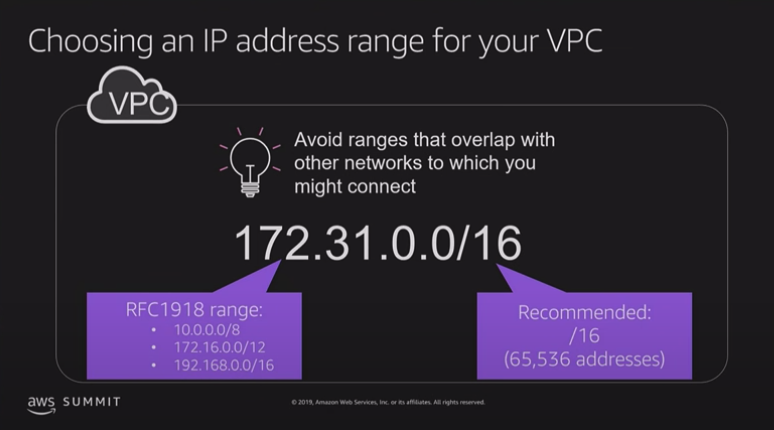
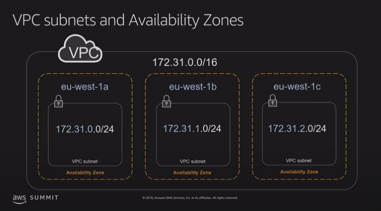
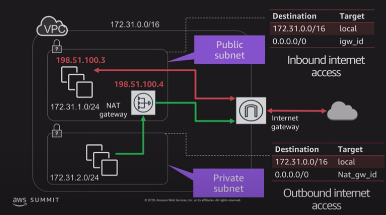

## Elastic Network Interface
An elastic network interface is a logical networking component in a VPC that represents a virtual network card. It can include the following attributes:

* A primary private IPv4 address from the IPv4 address range of your VPC
* One or more secondary private IPv4 addresses from the IPv4 address range of your VPC
* One Elastic IP address (IPv4) per private IPv4 address
* One public IPv4 address
* One or more IPv6 addresses
* One or more security groups
* A MAC address
* A source/destination check flag
* A description

* You can create a network interface, attach it to an instance, detach it from an instance, and attach it to another instance
* The attributes of a network interface follow it as it's attached or detached from an instance and reattached to another instance. When you move a network interface from one instance to another, network traffic is redirected to the new instance
* Each instance has a default network interface, called the primary network interface
* You cannot detach a primary network interface from an instance
* You can create and attach additional network interfaces
* The maximum number of network interfaces that you can use varies by instance type
* When you create a network interface, it inherits the public IPv4 addressing attribute from the subnet
* Scenarios for network interfaces
    * Create a management network.
    * Use network and security appliances in your VPC.
    * Create dual-homed instances with workloads/roles on distinct subnets.
    * Create a low-budget, high-availability solution.

Creating a management n/w
---

## Route Table
* Route table defines rules, termed as routes, which determine where network traffic from the subnet would be routed
* Each VPC has a implicit router to route network traffic
* Each VPC has a Main Route table, and can have multiple custom route tables created
* Each Subnet within a VPC must be associated with a single route table at a time, while a route table can have multiple subnets associated with it
* Subnet, if not explicitly associated to a route table, is implicitly associated with the main route table
* Every route table contains a local route that enables communication within a VPC which cannot be modified or deleted
* Route priority is decided by matching the most specific route in the route table that matches the traffic
* Route tables needs to be updated to defined routes for Internet gateways, Virtual Private gateways, VPC Peering, VPC Endpoints, NAT Device etc.

## Shared prefix lists
* A prefix list is a set of one or more CIDR blocks
* There are two types of prefix lists:
    * AWS-managed prefix list - Represents the IP address ranges for an AWS service
    * Customer-managed prefix list - A set of IPv4 or IPv6 CIDR blocks that you define and manage

## Internet Gateway - IGW
* An internet gateway is a horizontally scaled, redundant, and highly available VPC component that allows communication between your VPC and the internet
* An internet gateway serves two purposes: 
    * to provide a target in your VPC route tables for internet-routable traffic, and * to perform network address translation (NAT) for instances that have been assigned public IPv4 addresses
* An internet gateway supports IPv4 and IPv6 traffic
* It does not cause availability risks or bandwidth constraints on your network traffic
* There's no additional charge for having an internet gateway in your account
* **To enable access to or from the internet for instances in a subnet in a VPC, you must do the following**
    * Create an internet gateway and attach it to your VPC.
    * Add a route to your subnet's route table that directs internet-bound traffic to the internet gateway.
    * Ensure that instances in your subnet have a globally unique IP address (public IPv4 address, Elastic IP address, or IPv6 address).
    * Ensure that your network access control lists and security group rules allow the relevant traffic to flow to and from your instance.

## Egress-only internet gateways
* An egress-only internet gateway is a horizontally scaled, redundant, and highly available VPC component that allows outbound communication over IPv6 from instances in your VPC to the internet, and prevents the internet from initiating an IPv6 connection with your instances
* An egress-only internet gateway is stateful: it forwards traffic from the instances in the subnet to the internet or other AWS services, and then sends the response back to the instances

## NAT 
* A NAT device forwards traffic from the instances in the private subnet to the internet or other AWS services, and then sends the response back to the instances
* When traffic goes to the internet, the source IPv4 address is replaced with the NAT device’s address and similarly, when the response traffic goes to those instances, the NAT device translates the address back to those instances’ private IPv4 addresses
* There are two types of NAT devices
    * NAT Instance
        * Launched from a NAT AMI
        * Single point of failure
    * NAT Gateway
        * Provides better availability and bandwidth
        * Managed service and do not require any administration
        * Create NAT Gateway in multiple AZ and assign it to the instances in that AZ for better availability
        * Can scale up to 45 Gbps.

|Attribute|NAT Gateway|NAT Instance|
|--- |--- |--- |
|Availability |Highly available. NAT gateways in each Availability Zone are implemented with redundancy. Create a NAT gateway in each Availability Zone to ensure zone-independent architecture. |Use a script to manage failover between instances. |
|Bandwidth |Can scale up to 45 Gbps. |Depends on the bandwidth of the instance type. |
|Maintenance |Managed by AWS. You do not need to perform any maintenance. |Managed by you, for example, by installing software updates or operating system patches on the instance. |
|Performance |Software is optimized for handling NAT traffic. |A generic Amazon Linux AMI that's configured to perform NAT. |
|Cost |Charged depending on the number of NAT gateways you use, duration of usage, and amount of data that you send through the NAT gateways. |Charged depending on the number of NAT instances that you use, duration of usage, and instance type and size. |
|Type and size |Uniform offering; you don’t need to decide on the type or size. |Choose a suitable instance type and size, according to your predicted workload. |
|Public IP addresses |Choose the Elastic IP address to associate with a NAT gateway at creation. |Use an Elastic IP address or a public IP address with a NAT instance. You can change the public IP address at any time by associating a new Elastic IP address with the instance. |
|Private IP addresses |Automatically selected from the subnet's IP address range when you create the gateway. |Assign a specific private IP address from the subnet's IP address range when you launch the instance. |
|Security groups |Cannot be associated with a NAT gateway. You can associate security groups with your resources behind the NAT gateway to control inbound and outbound traffic. |Associate with your NAT instance and the resources behind your NAT instance to control inbound and outbound traffic. |
|Network ACLs |Use a network ACL to control the traffic to and from the subnet in which your NAT gateway resides. |Use a network ACL to control the traffic to and from the subnet in which your NAT instance resides. |
| | | |

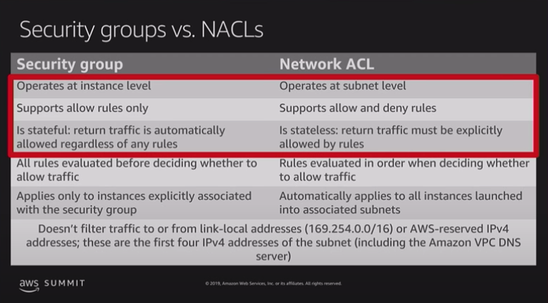

## VPC Flow logs

* VPC Flow Logs is a feature that enables you to capture information about the IP traffic going to and from network interfaces in the VPC and can help in monitoring the traffic or troubleshooting any connectivity issues
* Flow log data is stored using Amazon CloudWatch Logs
* Flow log can be created for the entire VPC, subnets or each network interface. If enabled, for entire VPC or subnet all the network interfaces are monitored
* Flow logs do not capture real-time log streams for network interfaces.
* Flow logs can be created for network interfaces that are created by other AWS services; for example, Elastic Load Balancing, RDS, ElastiCache, Redshift, and WorkSpaces

## VPC Security
Security within a VPC is provided through

* Security groups – Act as a firewall for associated EC2 instances, controlling both inbound and outbound traffic at the instance level
* Network access control lists (ACLs) – Act as a firewall for associated subnets, controlling both inbound and outbound traffic at the subnet level
* Flow logs – Capture information about the IP traffic going to and from network interfaces in your VPC

## VPC Peering
* A VPC peering connection is a networking connection between two VPCs that enables you to route traffic between them privately
* You can peer one VPC to another VPC using private IP subnets
* You can peer VPC's with others AWS accounts as well as with other VPC's in the same account.

### How to VPC Peering

* Overlapping CIDR Blocks is not supported: You can't connect two VPC's that have the same CIDR.
* Transitive Peering is not supported:

    You have a VPC peering connection between VPC A and VPC B (pcx-aaaabbbb), and between VPC A and VPC C (pcx-aaaacccc). There is no VPC peering connection between VPC B and VPC C. You cannot route packets directly from VPC B to VPC C through VPC A.

    

### Build Your Own Custome VPC

* [VPC and Subnet Sizing](https://docs.aws.amazon.com/vpc/latest/userguide/VPC_Subnets.html#vpc-subnet-basics) The first four IP addresses and the last IP address in each subnet CIDR block are not available for you to use, and cannot be assigned to an instance.

* For Nat Instances you have to disable the [Source/Destination Checks](https://docs.aws.amazon.com/vpc/latest/userguide/VPC_NAT_Instance.html#EIP_Disable_SrcDestCheck).
* Use [Nat Gateways](https://docs.aws.amazon.com/vpc/latest/userguide/vpc-nat-gateway.html#nat-gateway-basics) instead of Nat Instances

    

## Building a custom VPC
### STEP 1
* You can choose your IPV4 CIDR block 
* You have an option to choose IPv6 CIDR block
* Will create a new
    * Main Route Table (It controls the routing of all subnets that are not explicitly associated with any other route table)
    * NACL
    * Defauly Security group
* Will **not** create a subnet or IGW

### STEP 2
* Create new subnets (public & private)
* One subnet can only span one AZ
* AWS will reserve 5 IP address for internal use
* Allowed block size is between /16 (65,536 IPs) to /28 (16 IPs) - 2**(32-16) = 2**16 = 65,536
* you can provide
    * A VPC name under which this subnet will be created
    * Choose an AZ
    * Provide an IPv4 CIRD
    * You can also assign an IPv6 CIDR
* After creating a subnet Auto Assign public IP to make one of the subnet as public public

### STEP 3
* Add an IGW
* After creating IGW attach the IGW to your VPC
* Only have one IGW per VPC
* IGW are highly available and scalable

### STEP 4
* All new subnet that we create will by default be private as they are auto assigned to the Main Route Table. That is created when we create a custom VPC. If we add a route to the Main Route Table to connect to the internet then all the subnets within that VPC will be public which will be a security concern. That is why we create a new Route Table and add the route out to internet to that new Route Table.
* Create a new Route Table
* Edit routes and add an entry for IPv4 and IPv6 to route out to internet through IGW to make this Route Table as public
* Associate the subnet that you want to be public to the new public Route Table that we created
* Private subnets will still be associated to the Main Route Table

### STEP 5
* Launch EC instances in the public subnet but selecting the new VPC and public subnet while creating a new EC2 instance
* Instances launched in public subnet will have a public IP address where as instances launched in private subnets will not
* By default instance in public & private subnets will not be able to talk to each other

### STEP 6
* Create a new security group for private subnet
* Add inbound rules for opening DB / HTTPS / HTTP / SSH etc
* Assign this new Security group to the instances in the private subnet

### STEP 7
* we need to enable our EC2 instances in private subnet to talk to the internet to get software updates so we need a way out. NAT instance and NAT Gateway are the two ways through which we can do that
* NAT Instances
    * Launch a new EC2 instance in the public subnet within the VPC
    * By default all EC2 instances does a **"Source/Destination checks"** by default - means that the instance must be source or destination of any traffic that it send or receives. But our NAT instance should be able to send and recieve traffic when the source or destination is not itself. **This means we need to disable Source/Destination check for a NAT instance**
    * Add a route to the Main Route Table and add a route 
        * 0.0.0.0/0 (Destination) -> id of the NAT instance(Target) 
    * NAT instance are a single EC2 instance which cannot automatically scale and can be a botleneck (single point of failure). To overcome this we have NAT  Gateway
* NAT Gateway
    * Create a NAT Gateway bu selecting the public subnet
    * Edit the Main Route table and add a route fr this NAT Gateway
        * 0.0.0.0/0 (Destination) -> id of the NAT Gateway(Target) 
    * Can take sometime to setup
    * NAT Gateway are redundant inside AZ
    * One NAT Gateway = One AZ
    * Do not need to patch
    * Not associates to Security Group
    * No IP address will be associated
    * If multiple subnets use the same NAT Gateway then it will be a single point of failure of that AZ goes down. Best practice is to create NAT Gateway for each AZ and configure route table such that resources uses the NAT Gateway in the same AZ

### [Network Access Control Lists vs Security Groups](https://docs.aws.amazon.com/vpc/latest/userguide/VPC_Security.html)

* NACL cannot be deployed in multiple VPCs
* NACL cannot be attached to multiple subnets, only one at the time
* Each subnet must be associated with a network ACL, if you don't, default NACL will be used
* Default NACL allows all inbound and outbound traffic
* By default when you create one NACL, everything is denied
* Rules are applied in numerical order (starting from the lowest), so when you should create the first rule having number 100 and add others on incremental of 100
* You need to have a deny rule before allow as NACL rules are evaluated in order
* NACL are **stateless** (opposite of Security Groups)
* Remember to open [ephemaral ports](https://docs.aws.amazon.com/vpc/latest/userguide/vpc-network-acls.html#nacl-ephemeral-ports) on your outbound rules only
* If you have to block specific IP addresses, use network ACL not Security Groups
* NACL are always evaluated before security groups

### Custom VPC's and ELB's

* Design tip: Remember that ELB needs at least two public AZ's, so when designing your network, remember to create at least two public subnets in two AZ.

### [VPC Flow Logs](https://docs.aws.amazon.com/vpc/latest/userguide/flow-logs.html)

VPC Flow Logs is a feature that enables you to capture information about the IP traffic going to and from network interfaces in your VPC. Flow log data can be published to Amazon CloudWatch Logs and Amazon S3. After you've created a flow log, you can retrieve and view its data in the chosen destination.

### [VPC Enpoints](https://docs.aws.amazon.com/vpc/latest/userguide/vpc-endpoints.html)

A VPC endpoint enables you to privately connect your VPC to supported AWS services and VPC endpoint services powered by PrivateLink without requiring an internet gateway, NAT device, VPN connection, or AWS Direct Connect connection. The following AWS services support this feature: Amazon Elastic Compute Cloud (EC2), Elastic Load Balancing (ELB), Kinesis Streams, Service Catalog, EC2 Systems Manager, Amazon SNS, and AWS DataSync. Many SaaS solutions support this feature as well.

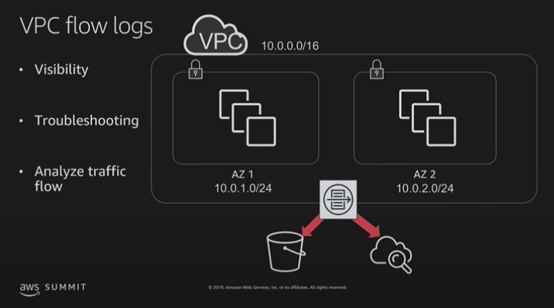
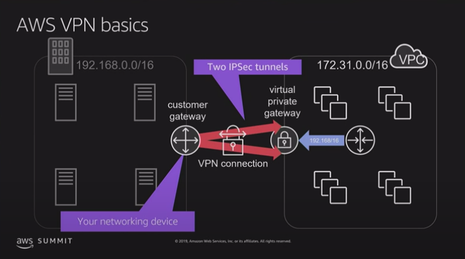
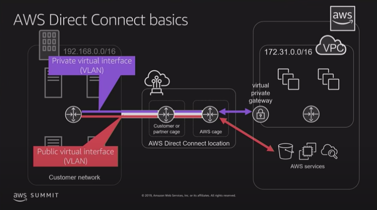
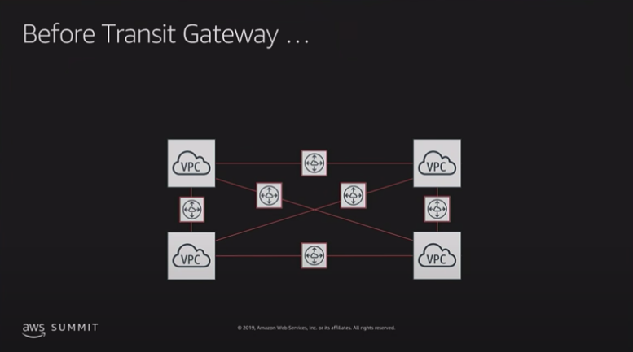
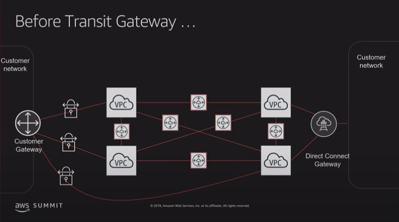
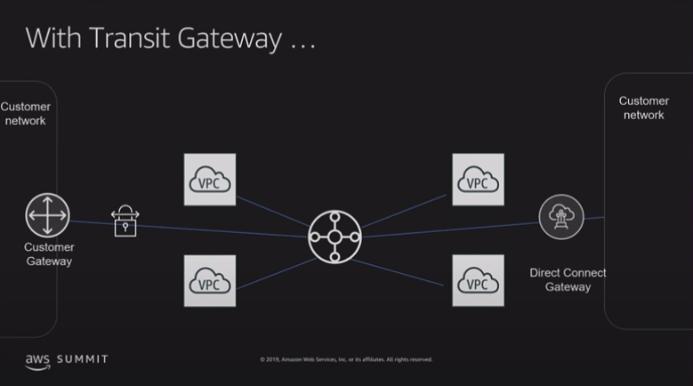
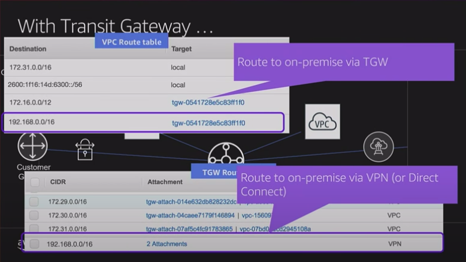
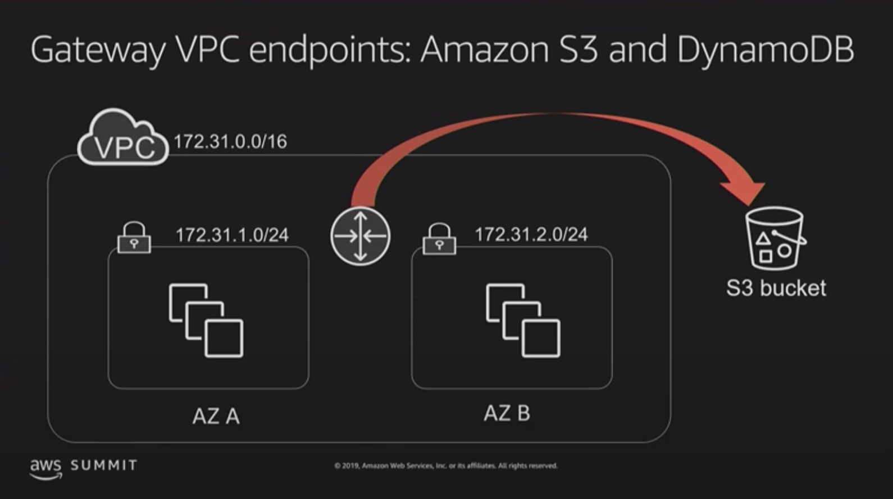

## Deleting your VPC

To delete a VPC using the VPC console, you must first terminate or delete the following components:

* All instances in the VPC - For information about how to terminate an instance
* VPC peering connections
* Interface endpoints
* NAT gateways

When you delete a VPC using the VPC console, we also delete the following VPC components for you:
* Subnets
* Security groups
* Network ACLs
* Route tables
* Gateway endpoints
* Internet gateways
* Egress-only internet gateways
* DHCP options

If you have a AWS Site-to-Site VPN connection, you don't have to delete it or the other components related to the VPN (such as the customer gateway and virtual private gateway)

## Amazon VPC console wizard configurations
You can use the Amazon VPC Console wizard to create one of the following nondefault VPC configurations.
* VPC with a single public subnet
* VPC with public and private subnets (NAT)
* VPC with public and private subnets and AWS Site-to-Site VPN access
* VPC with a private subnet only and AWS Site-to-Site VPN access

Q. What are the connectivity options for my Amazon VPC?
---
You may connect your Amazon VPC to:

The internet (via an internet gateway)
Your corporate data center using an AWS Site-to-Site VPN connection (via the virtual private gateway)
Both the internet and your corporate data center (utilizing both an internet gateway and a virtual private gateway)
Other AWS services (via internet gateway, NAT, virtual private gateway, or VPC endpoints)
Other Amazon VPCs (via VPC peering connections)

Q. How do instances without public IP addresses access the Internet
 ---
Instances without public IP addresses can access the Internet in one of two ways:
Instances without public IP addresses can route their traffic through a NAT gateway or a NAT instance to access the Internet. These instances use the public IP address of the NAT gateway or NAT instance to traverse the Internet. The NAT gateway or NAT instance allows outbound communication but doesn’t allow machines on the Internet to initiate a connection to the privately addressed instances.
For VPCs with a hardware VPN connection or Direct Connect connection, instances can route their Internet traffic down the virtual private gateway to your existing datacenter. From there, it can access the Internet via your existing egress points and network security/monitoring devices.

Q. Does traffic go over the internet when two instances communicate using public IP addresses?
 ---
Traffic between two EC2 instances in the same AWS Region stays within the AWS network, even when it goes over public IP addresses.
Traffic between EC2 instances in different AWS Regions stays within the AWS network, if there is an Inter-Region VPC Peering connection between the VPCs where the two instances reside.
Traffic between EC2 instances in different AWS Regions where there is no Inter-Region VPC Peering connection between the VPCs where these instances reside, is not guaranteed to stay within the AWS network.

Q. How large of a VPC can I create?
---
Currently, Amazon VPC supports five (5) IP address ranges, one (1) primary and four (4) secondary for IPv4. Each of these ranges can be between /28 (in CIDR notation) and /16 in size. The IP address ranges of your VPC should not overlap with the IP address ranges of your existing network.

For IPv6, the VPC is a fixed size of /56 (in CIDR notation). A VPC can have both IPv4 and IPv6 CIDR blocks associated to it.

Q. Can I change the size of a VPC?
---
Yes. You can expand your existing VPC by adding four (4) secondary IPv4 IP ranges (CIDRs) to your VPC. You can shrink your VPC by deleting the secondary CIDR blocks you have added to your VPC. You cannot however change the size of the IPv6 address range of your VPC.

Q. How many subnets can I create per VPC?
---
Currently you can create 200 subnets per VPC. If you would like to create more, please submit a case at the support center.

Q. Is there a limit on how large or small a subnet can be?
---
The minimum size of a subnet is a /28 (or 14 IP addresses.) for IPv4. Subnets cannot be larger than the VPC in which they are created.

For IPv6, the subnet size is fixed to be a /64. Only one IPv6 CIDR block can be allocated to a subnet.

Q. Can I use all the IP addresses that I assign to a subnet?
---
No. Amazon reserves the first four (4) IP addresses and the last one (1) IP address of every subnet for IP networking purposes. 

Q. How is Amazon VPC traffic mirroring different from Amazon VPC flow logs?
---
Amazon VPC flow logs allow customers to collect, store, and analyze network flow logs. The information captured in flow logs includes information about allowed and denied traffic, source and destination IP addresses, ports, protocol number, packet and byte counts, and an action (accept or reject). You can use this feature to troubleshoot connectivity and security issues and to make sure that the network access rules are working as expected.

Amazon VPC traffic mirroring, provides deeper insight into network traffic by allowing you to analyze actual traffic content, including payload, and is targeted for use-cases when you need to analyze the actual packets to determine the root cause a performance issue, reverse-engineer a sophisticated network attack, or detect and stop insider abuse or compromised workloads.

Q. How many Amazon EC2 instances can I use within a VPC?
---
You can run any number of Amazon EC2 instances within a VPC, so long as your VPC is appropriately sized to have an IP address assigned to each instance. You are initially limited to launching 20 Amazon EC2 instances at any one time and a maximum VPC size of /16 (65,536 IPs).

Q: Can I boot an Amazon EC2 instance from an Amazon EBS volume within Amazon VPC?
---
Yes, however, an instance launched in a VPC using an Amazon EBS-backed AMI maintains the same IP address when stopped and restarted. This is in contrast to similar instances launched outside a VPC, which get a new IP address. The IP addresses for any stopped instances in a subnet are considered unavailable.

Q. Can I create additional subnets in my default VPC, such as private subnets?
---
Yes. To launch into nondefault subnets, you can target your launches using the console or the --subnet option from the CLI, API, or SDK.

Q. What is the IP range of a default VPC?
---
The default VPC CIDR is 172.31.0.0/16. Default subnets use /20 CIDRs within the default VPC CIDR.

Q. Can I attach or detach one or more network interfaces to an EC2 instance while it’s running?
---
Yes.

Q. Can I have more than two network interfaces attached to my EC2 instance?
---
The total number of network interfaces that can be attached to an EC2 instance depends on the instance type. 

Q. Can I attach a network interface in one Availability Zone to an instance in another Availability Zone?
---
Network interfaces can only be attached to instances residing in the same Availability Zone.

Q. Can I attach a network interface in one VPC to an instance in another VPC?
---
Network interfaces can only be attached to instances in the same VPC as the interface.

Q. Can I create a peering connection to a VPC in a different region?
---
Yes. Peering connections can be created with VPCs in different regions. Inter-region VPC peering is available globally in all commercial regions (excluding China).

Q. Can I use AWS Direct Connect or hardware VPN connections to access VPCs I’m peered with?
---
No. “Edge to Edge routing” isn’t supported in Amazon VPC.

Q. Is VPC peering traffic within the region encrypted?
---
No. Traffic between instances in peered VPCs remains private and isolated – similar to how traffic between two instances in the same VPC is private and isolated.

Q. Is Inter-Region VPC Peering traffic encrypted?
---
Traffic is encrypted using modern AEAD (Authenticated Encryption with Associated Data) algorithms. Key agreement and key management is handled by AWS.

Q. What if my peering connection goes down?
---
AWS uses the existing infrastructure of a VPC to create a VPC peering connection; it is neither a gateway nor a VPN connection, and does not rely on a separate piece of physical hardware. There is no single point of failure for communication or a bandwidth bottleneck.

Inter-Region VPC Peering operates on the same horizontally scaled, redundant, and highly available technology that powers VPC today. Inter-Region VPC Peering traffic goes over the AWS backbone that has in-built redundancy and dynamic bandwidth allocation. There is no single point of failure for communication.

If an Inter-Region peering connection does go down, the traffic will not be routed over the internet.

Q. What CloudWatch metrics are available for the interface-based VPC endpoint?
---
Currently, no CloudWatch metric is available for the interface-based VPC endpoint.

Q. Who pays the data transfer costs for the traffic going via the interface-based VPC endpoint?
---
The concept of data transfer costs is similar to that of data transfer costs for EC2 instances. Since an interface-based VPC endpoint is an ENI in the subnet, data transfer charges depend on the source of the traffic. If the traffic to this interface is coming from a resource across AZ, EC2 cross-AZ data transfer charges apply to the consumer end. Customers in the consumer VPC can use AZ-specific DNS endpoint to make sure the traffic stays within the same AZ if they have provisioned each AZ available in their account.

Q. How many VPCs, subnets, Elastic IP addresses, and internet gateways can I create?
---
You can have:

Five Amazon VPCs per AWS account per region
Two hundred subnets per Amazon VPC
Five Amazon VPC Elastic IP addresses per AWS account per region
One internet gateway per Amazon VPC

10.20.12.23/20 - This subnet will have 2**(32-20) = 4096 IP address

10.20.12.23/16 = 2**(32-16) = 65536
