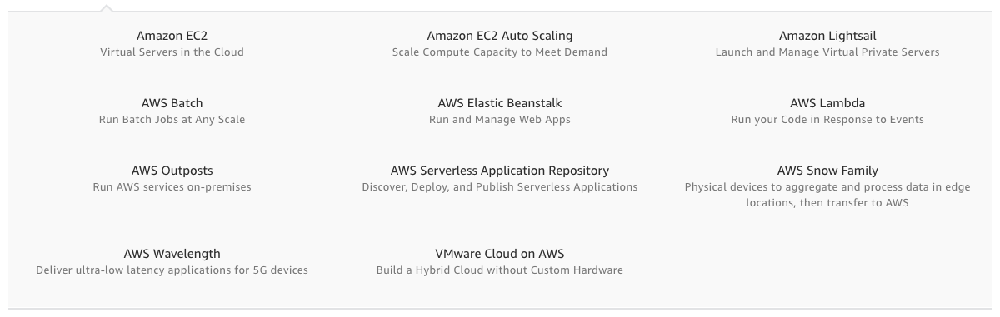

## Difference b/w 
* Application Load Balancer (ALB)
* Network Load Balancer (NLB)
* Gateway Load Balancer
* Classic Load Balancer

| Feature | ALB | NLB | GLB | CLB |
| --- | --- | --- | --- | --- |
| Load Balancer Type | Layer 7 | Layer 4 | Layer 3 Gateway + Layer 4 Load Balancing | Layer 4/7 |
| Protocol listeners | HTTP, HTTPS, gRPC | HTTP, HTTPS, gRPC | IP | TCP, SSL/TLS, HTTP, HTTPS |
|  |  |  |  |  |

### [Amazon Elastic Contaioner Service (ECS)](https://aws.amazon.com/ecs/faqs/)

### Amazon Kenesis
----------

## AWS Products

## Security, Identity & Compliance

## Storage

## Compute

## Database

## Network Content & Delivery

## Serverless

# Networking and Content Delivery on AWS
## Build a cloud network
* [Amazon VPC](https://aws.amazon.com/vpc/?c=nt&sec=srv) - Define and provision a logically isolated network for your AWS resources
* [AWS Transit Gateway](https://aws.amazon.com/transit-gateway/?c=sc&sec=srv) - Connect VPCs and on-premises networks through a central hub
* [AWS PrivateLink](https://aws.amazon.com/privatelink/?c=nt&sec=srv) - Provide private connectivity between VPCs, services, and on-premises applications
* [Amazon Route 53](https://aws.amazon.com/route53/?c=nt&sec=srv) - Route users to Internet applications with a managed DNS service

## Scale your network design
* [Elastic Load Balancing](https://aws.amazon.com/elasticloadbalancing/?c=nt&sec=srv) - Automatically distribute traffic across a pool of resources, such as instances, containers, IP addresses, and Lambda functions
* [AWS Global Accelerator](https://aws.amazon.com/global-accelerator/?c=nt&sec=srv) - Direct traffic through the AWS Global network to improve global application performance

## Secure your network traffic
* [AWS Shield](https://aws.amazon.com/shield/?c=nt&sec=srv) - Safeguard applications running on AWS against DDoS attacks 
* [AWS WAF](https://aws.amazon.com/waf/?c=nt&sec=srv) - Protect your web applications from common web exploits
* [AWS Firewall Manager](https://aws.amazon.com/firewall-manager/?c=nt&sec=srv) - Centrally configure and manage firewall rules

## Build a hybrid IT network
* [AWS Virtual Private Network (VPN) - Client](https://aws.amazon.com/vpn/?c=nt&sec=srv) - Connect your users to AWS or on-premises resources using a Virtual Private Network
* [AWS Virtual Private Network (VPN) - Site to Site](https://aws.amazon.com/vpn/?c=nt&sec=srv) - Create an encrypted connection between your network and your Amazon VPCs or AWS Transit Gateways
* [AWS Direct Connect](https://aws.amazon.com/directconnect/?c=nt&sec=srv) - Establish a private, dedicated connection between AWS and your datacenter, office, or colocation environment

## Content delivery networks
* [Amazon CloudFront](https://aws.amazon.com/cloudfront/?c=nt&sec=srv) - Securely deliver data, videos, applications, and APIs to customers globally with low latency, and high transfer speeds

## Build a network for microservices architectures
* [AWS App Mesh](https://aws.amazon.com/app-mesh/?c=nt&sec=srv) - Provide application-level networking for containers and microservices
* [Amazon API Gateway](https://aws.amazon.com/api-gateway/?c=nt&sec=srv) - Create, maintain, and secure APIs at any scale
* [AWS Cloud Map](https://aws.amazon.com/cloud-map/?c=nt&sec=srv) - Discover AWS services connected to your applications