# CHAPTER 7 | VPC

## VPC

### [Wat's a VPC](https://aws.amazon.com/vpc/)

Think of a VPC as a virtual data centre in the cloud.

Amazon Virtual Private Cloud (Amazon VPC) lets you provision a logically isolated section of the AWS Cloud where you can launch AWS resources in a virtual network that you define. You have complete control over your virtual networking environment, including selection of your own IP address range, creation of subnets, and configuration of route tables and network gateways.

### What are the components of Amazon VPC

* A Virtual Private Cloud: A logically isolated virtual network in the AWS cloud. You define a VPC’s IP address space from ranges you select.
* Subnet: A segment of a VPC’s IP address range where you can place groups of isolated resources.
* Internet Gateway: The Amazon VPC side of a connection to the public Internet.
* NAT Gateway: A highly available, managed Network Address Translation (NAT) service for your resources in a private subnet to access the Internet.
* Virtual private gateway: The Amazon VPC side of a VPN connection.
* Peering Connection: A peering connection enables you to route traffic via private IP addresses between two peered VPCs.
* VPC Endpoints: Enables private connectivity to services hosted in AWS, from within your VPC without using an Internet Gateway, VPN, Network Address Translation (NAT) devices, or firewall proxies. There are two types of VPC endpoint - gateway type & interface type endpoint. Gateway endpoint is only for Amazon S3 and DynamoDB.

* Egress-only Internet Gateway: A stateful gateway to provide egress only access for **IPv6** traffic from the VPC to the Internet.

* You can have multiple VPC in a region (default up to 5).
* You can have 1 internet gateway per VPC.
* 1 Subnet = 1 AZ
* Security groups are Stateful, instead, Network ACLs are stateless.

### Default VPC

* Amazon provides a default VPC to immediately deploy instances.
* All Subnets in default VPC have a route out to the internet.

### VPC Peering

* You can peer one VPC to another VPC using private IP subnets.
* You can peer VPC's with others AWS accounts as well as with other VPC's in the same account.

### How to VPC Peering

* Overlapping CIDR Blocks is not supported: You can't connect two VPC's that have the same CIDR.
* Transitive Peering is not supported:

    You have a VPC peering connection between VPC A and VPC B (pcx-aaaabbbb), and between VPC A and VPC C (pcx-aaaacccc). There is no VPC peering connection between VPC B and VPC C. You cannot route packets directly from VPC B to VPC C through VPC A.

    

### Build Your Own Custome VPC

* [VPC and Subnet Sizing](https://docs.aws.amazon.com/vpc/latest/userguide/VPC_Subnets.html#vpc-subnet-basics) The first four IP addresses and the last IP address in each subnet CIDR block are not available for you to use, and cannot be assigned to an instance.

* For Nat Instances you have to disable the [Source/Destination Checks](https://docs.aws.amazon.com/vpc/latest/userguide/VPC_NAT_Instance.html#EIP_Disable_SrcDestCheck).
* Use [Nat Gateways](https://docs.aws.amazon.com/vpc/latest/userguide/vpc-nat-gateway.html#nat-gateway-basics) instead of Nat Instances

    

### [Network Access Control Lists vs Security Groups](https://docs.aws.amazon.com/vpc/latest/userguide/VPC_Security.html)

* NACL cannot be deployed in multiple VPCs.
* NACL cannot be attached to multiple subnets, only one at the time.
* Each subnet must be associated with a network ACL, if you don't, default NACL will be used.
* By default when you create one NACL, everything is denied.
* Rules are applied in numerical order (starting from the lowest), so when you should create the first rule having number 100 and add others on incremental of 100
* NACL are **stateless** (opposite of Security Groups)
* Remember to open [ephemaral ports](https://docs.aws.amazon.com/vpc/latest/userguide/vpc-network-acls.html#nacl-ephemeral-ports) on your outbound rules only.
* If you have to block specific IP addresses, use network ACL not Security Groups

### Custom VPC's and ELB's

* Design tip: Remember that ELB needs at least two public AZ's, so when designing your network, remember to create at least two public subnets in two AZ.

### [VPC Flow Logs](https://docs.aws.amazon.com/vpc/latest/userguide/flow-logs.html)

VPC Flow Logs is a feature that enables you to capture information about the IP traffic going to and from network interfaces in your VPC. Flow log data can be published to Amazon CloudWatch Logs and Amazon S3. After you've created a flow log, you can retrieve and view its data in the chosen destination.

### [VPC Enpoints](https://docs.aws.amazon.com/vpc/latest/userguide/vpc-endpoints.html)

A VPC endpoint enables you to privately connect your VPC to supported AWS services and VPC endpoint services powered by PrivateLink without requiring an internet gateway, NAT device, VPN connection, or AWS Direct Connect connection. The following AWS services support this feature: Amazon Elastic Compute Cloud (EC2), Elastic Load Balancing (ELB), Kinesis Streams, Service Catalog, EC2 Systems Manager, Amazon SNS, and AWS DataSync. Many SaaS solutions support this feature as well.

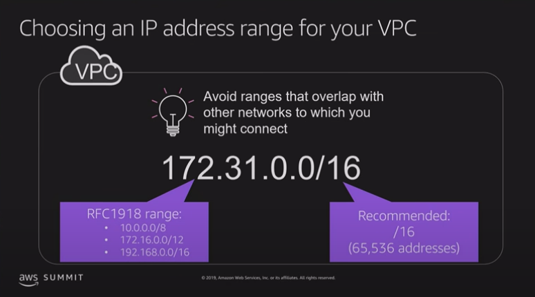
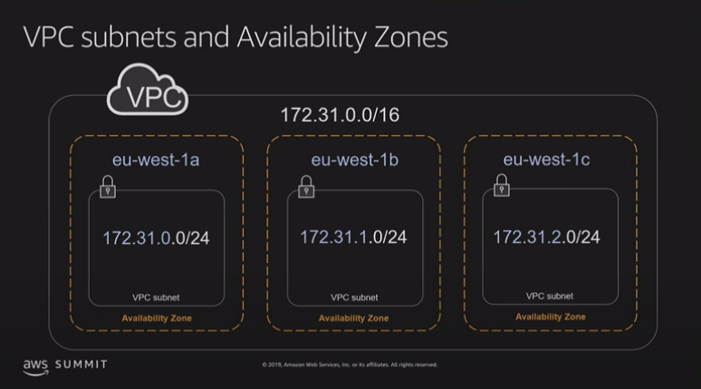
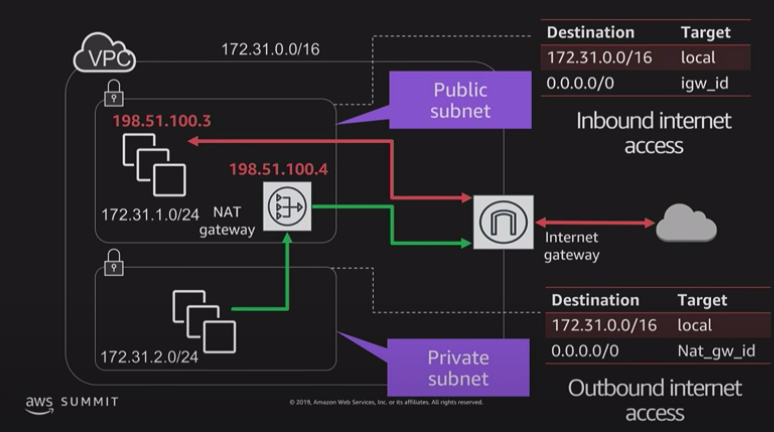
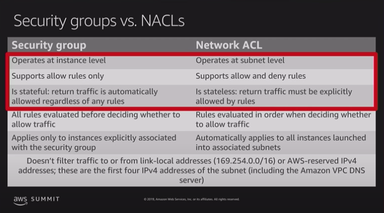
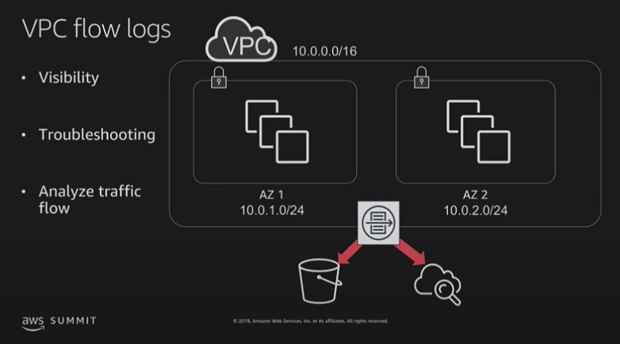
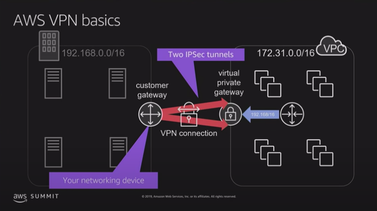
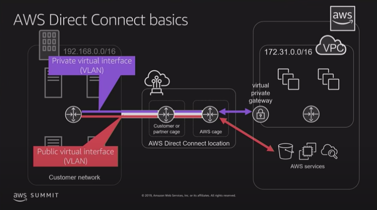
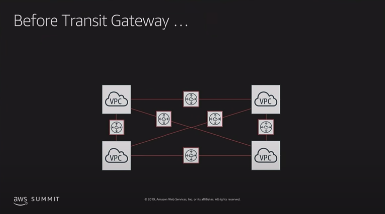
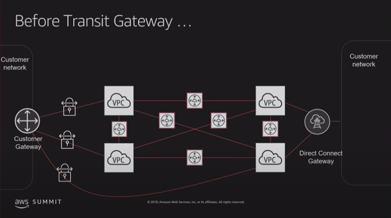
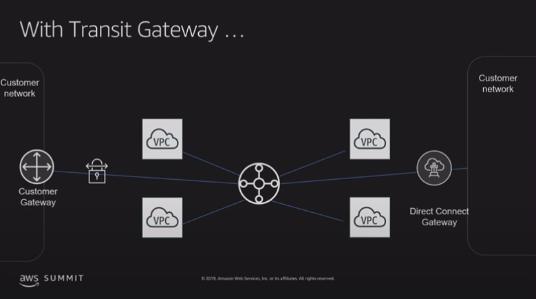
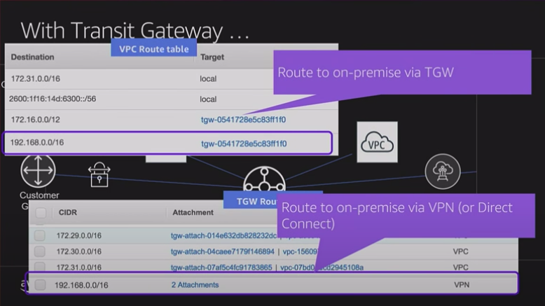
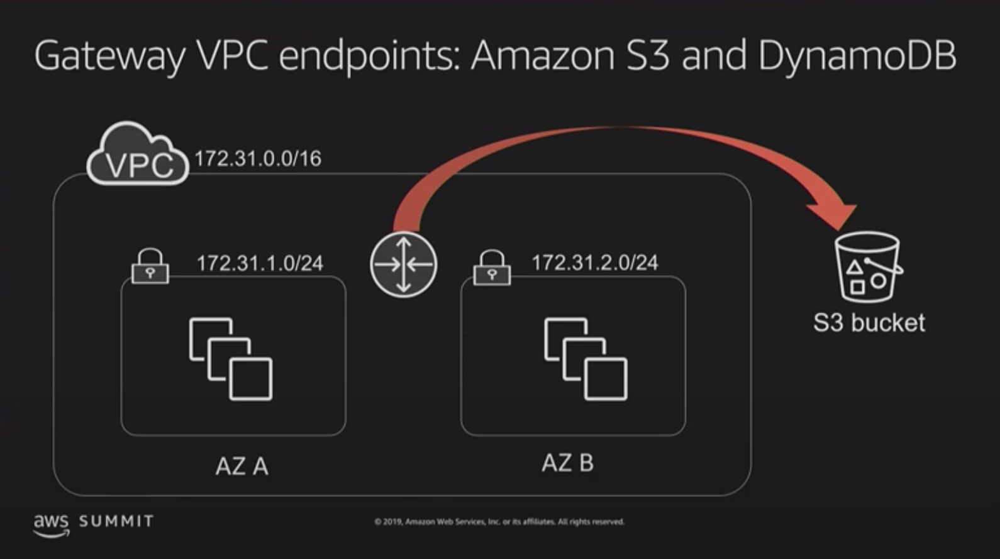

Q. What are the connectivity options for my Amazon VPC?
---
You may connect your Amazon VPC to:

The internet (via an internet gateway)
Your corporate data center using an AWS Site-to-Site VPN connection (via the virtual private gateway)
Both the internet and your corporate data center (utilizing both an internet gateway and a virtual private gateway)
Other AWS services (via internet gateway, NAT, virtual private gateway, or VPC endpoints)
Other Amazon VPCs (via VPC peering connections)

Q. How do instances without public IP addresses access the Internet
 ---
Instances without public IP addresses can access the Internet in one of two ways:
Instances without public IP addresses can route their traffic through a NAT gateway or a NAT instance to access the Internet. These instances use the public IP address of the NAT gateway or NAT instance to traverse the Internet. The NAT gateway or NAT instance allows outbound communication but doesn’t allow machines on the Internet to initiate a connection to the privately addressed instances.
For VPCs with a hardware VPN connection or Direct Connect connection, instances can route their Internet traffic down the virtual private gateway to your existing datacenter. From there, it can access the Internet via your existing egress points and network security/monitoring devices.

Q. Does traffic go over the internet when two instances communicate using public IP addresses?
 ---
Traffic between two EC2 instances in the same AWS Region stays within the AWS network, even when it goes over public IP addresses.
Traffic between EC2 instances in different AWS Regions stays within the AWS network, if there is an Inter-Region VPC Peering connection between the VPCs where the two instances reside.
Traffic between EC2 instances in different AWS Regions where there is no Inter-Region VPC Peering connection between the VPCs where these instances reside, is not guaranteed to stay within the AWS network.

Q. How large of a VPC can I create?
---
Currently, Amazon VPC supports five (5) IP address ranges, one (1) primary and four (4) secondary for IPv4. Each of these ranges can be between /28 (in CIDR notation) and /16 in size. The IP address ranges of your VPC should not overlap with the IP address ranges of your existing network.

For IPv6, the VPC is a fixed size of /56 (in CIDR notation). A VPC can have both IPv4 and IPv6 CIDR blocks associated to it.

Q. Can I change the size of a VPC?
---
Yes. You can expand your existing VPC by adding four (4) secondary IPv4 IP ranges (CIDRs) to your VPC. You can shrink your VPC by deleting the secondary CIDR blocks you have added to your VPC. You cannot however change the size of the IPv6 address range of your VPC.

Q. How many subnets can I create per VPC?
---
Currently you can create 200 subnets per VPC. If you would like to create more, please submit a case at the support center.

Q. Is there a limit on how large or small a subnet can be?
---
The minimum size of a subnet is a /28 (or 14 IP addresses.) for IPv4. Subnets cannot be larger than the VPC in which they are created.

For IPv6, the subnet size is fixed to be a /64. Only one IPv6 CIDR block can be allocated to a subnet.

Q. Can I use all the IP addresses that I assign to a subnet?
---
No. Amazon reserves the first four (4) IP addresses and the last one (1) IP address of every subnet for IP networking purposes. 

Q. How is Amazon VPC traffic mirroring different from Amazon VPC flow logs?
---
Amazon VPC flow logs allow customers to collect, store, and analyze network flow logs. The information captured in flow logs includes information about allowed and denied traffic, source and destination IP addresses, ports, protocol number, packet and byte counts, and an action (accept or reject). You can use this feature to troubleshoot connectivity and security issues and to make sure that the network access rules are working as expected.

Amazon VPC traffic mirroring, provides deeper insight into network traffic by allowing you to analyze actual traffic content, including payload, and is targeted for use-cases when you need to analyze the actual packets to determine the root cause a performance issue, reverse-engineer a sophisticated network attack, or detect and stop insider abuse or compromised workloads.

Q. How many Amazon EC2 instances can I use within a VPC?
---
You can run any number of Amazon EC2 instances within a VPC, so long as your VPC is appropriately sized to have an IP address assigned to each instance. You are initially limited to launching 20 Amazon EC2 instances at any one time and a maximum VPC size of /16 (65,536 IPs).

Q: Can I boot an Amazon EC2 instance from an Amazon EBS volume within Amazon VPC?
---
Yes, however, an instance launched in a VPC using an Amazon EBS-backed AMI maintains the same IP address when stopped and restarted. This is in contrast to similar instances launched outside a VPC, which get a new IP address. The IP addresses for any stopped instances in a subnet are considered unavailable.

Q. Can I create additional subnets in my default VPC, such as private subnets?
---
Yes. To launch into nondefault subnets, you can target your launches using the console or the --subnet option from the CLI, API, or SDK.

Q. What is the IP range of a default VPC?
---
The default VPC CIDR is 172.31.0.0/16. Default subnets use /20 CIDRs within the default VPC CIDR.

Q. Can I attach or detach one or more network interfaces to an EC2 instance while it’s running?
---
Yes.

Q. Can I have more than two network interfaces attached to my EC2 instance?
---
The total number of network interfaces that can be attached to an EC2 instance depends on the instance type. 

Q. Can I attach a network interface in one Availability Zone to an instance in another Availability Zone?
---
Network interfaces can only be attached to instances residing in the same Availability Zone.

Q. Can I attach a network interface in one VPC to an instance in another VPC?
---
Network interfaces can only be attached to instances in the same VPC as the interface.

Q. Can I create a peering connection to a VPC in a different region?
---
Yes. Peering connections can be created with VPCs in different regions. Inter-region VPC peering is available globally in all commercial regions (excluding China).

Q. Can I use AWS Direct Connect or hardware VPN connections to access VPCs I’m peered with?
---
No. “Edge to Edge routing” isn’t supported in Amazon VPC.

Q. Is VPC peering traffic within the region encrypted?
---
No. Traffic between instances in peered VPCs remains private and isolated – similar to how traffic between two instances in the same VPC is private and isolated.

Q. Is Inter-Region VPC Peering traffic encrypted?
---
Traffic is encrypted using modern AEAD (Authenticated Encryption with Associated Data) algorithms. Key agreement and key management is handled by AWS.

Q. What if my peering connection goes down?
---
AWS uses the existing infrastructure of a VPC to create a VPC peering connection; it is neither a gateway nor a VPN connection, and does not rely on a separate piece of physical hardware. There is no single point of failure for communication or a bandwidth bottleneck.

Inter-Region VPC Peering operates on the same horizontally scaled, redundant, and highly available technology that powers VPC today. Inter-Region VPC Peering traffic goes over the AWS backbone that has in-built redundancy and dynamic bandwidth allocation. There is no single point of failure for communication.

If an Inter-Region peering connection does go down, the traffic will not be routed over the internet.

Q. What CloudWatch metrics are available for the interface-based VPC endpoint?
---
Currently, no CloudWatch metric is available for the interface-based VPC endpoint.

Q. Who pays the data transfer costs for the traffic going via the interface-based VPC endpoint?
---
The concept of data transfer costs is similar to that of data transfer costs for EC2 instances. Since an interface-based VPC endpoint is an ENI in the subnet, data transfer charges depend on the source of the traffic. If the traffic to this interface is coming from a resource across AZ, EC2 cross-AZ data transfer charges apply to the consumer end. Customers in the consumer VPC can use AZ-specific DNS endpoint to make sure the traffic stays within the same AZ if they have provisioned each AZ available in their account.

Q. How many VPCs, subnets, Elastic IP addresses, and internet gateways can I create?
---
You can have:

Five Amazon VPCs per AWS account per region
Two hundred subnets per Amazon VPC
Five Amazon VPC Elastic IP addresses per AWS account per region
One internet gateway per Amazon VPC

10.20.12.23/20 - This subnet will have 2**(32-20) = 4096 IP address

10.20.12.23/16 = 2**(32-16) = 65536
